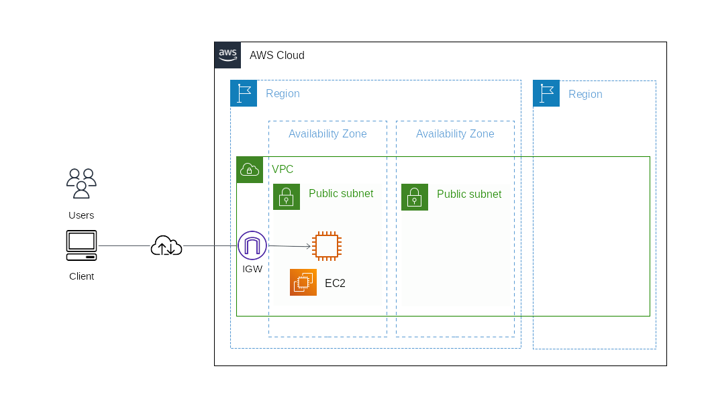

# AWSの基礎知識

## 目次

1. [AWS](#aws)
	1. [クラウド設計のポイント](#クラウド設計のポイント)
1. [AWSのコアサービス](#awsのコアサービス)
	1. [最重要サービス](#最重要サービス)
	1. [重要なサービス](#重要なサービス)
1. [リージョンとAZ](#リージョンとaz)
1. [マルチAZ](#マルチaz)

## AWS

**AWS**（Amazon Web Service）は、Amazonが提供するクラウドコンピューティングサービス。インターネットを介して、サーバやストレージ、データベース、ソフトウェアなどを利用することができる。

### クラウド設計のポイント

- **可用性**（システムが継続して稼働できる能力）の高い設計ができること
- **スケーラビリティ**と**パフォーマンス**を意識した設計画できること
- **コスト効率**を意識した設計ができること
- **セキュリティ**を担保した設計ができること

## AWSのコアサービス

### 最重要サービス

AWSで提供される数あるサービスの中でも、最も基本的で重要なサービスをいくつか示す。

**IAM**（AWS Identity and Access Management）は、ポリシーの作成やユーザに対する権限の付与などといった、権限管理のサービス。

**VPC**（Amazon Virtual Private Cloud）は、仮想ネットワーク環境におけるリソースの配置、接続性、セキュリティなどを制御するためのサービス。

**EC2**（Amazon Elastic Computing Cloud）は、Webサーバやバッチサーバなど様々な役割を持ったサーバを構築できるサービス。ディスク領域として**EBS**（Amazon Elastic Block Store）を使用するので、併せて理解を深めるとよい。**ECS**（Amazon Elastic Container Service）や**Lambda**との違いを意識して使い分けることがポイント。

**ELB**（Elastic Load balancing）は、EC2をWebサーバとして使用する際に、負荷分散の役割を果たすロードバランサのサービス。EC2のインスタンスを複数台配置してサーバの停止に備えるなど、可用性の高い設計を目指したときに必須となる。また、動的にサーバの数を増減させる**Auto Scaling**も、コスト最適化や可用性向上といった目的で重要なサービスとなる。

**RDS**（Amazon Relational Database Service）は、リレーショナルデータベースマネージドサービス（RDBMS）。中でもAWSが独自に開発したデータベースエンジンである**Aurora**は重要なので押さえておく。

**S3**（Amazon Simple Storage Service）は、オブジェクトストレージサービスである。ファイルが置かれたことをトリガーに後続の処理が動いたり、他のシステムとのファイル連携に利用したり、サーバログの定期的な退避先に使われたりと、広いユースケースのあるサービスである。

### 重要なサービス

続いて重要度が比較的高いサービスについて見ていく。

**Route53**は、AWSのDNSサービスである。新旧のシステムを入れ替えるブルーグリーンデプロイメントとの相性も良い。

**CloudWatch**は、AWSのリソースの状態や各種ログの監視を行うサービス。

**CloudFormation**は、インフラを自動構築するサービス。また、自動構築を支援するサービスとしては**Elastic Beanstalk**や**OpsWorks**といったサービスもある。

## リージョンとAZ

**リージョン**は、AWSがサービスを提供している拠点を指し、世界の各地に存在する。リージョン内には複数のアベイラビリティゾーン (**AZ**) が含まれ、1つのAZは複数のデータセンターから構成されている。

## マルチAZ

耐障害性やシステムの可用性を高めるには複数のAZ（異なるAZをまたいで作る）を利用した**マルチAZ**によりシステムを構成するとよい。
