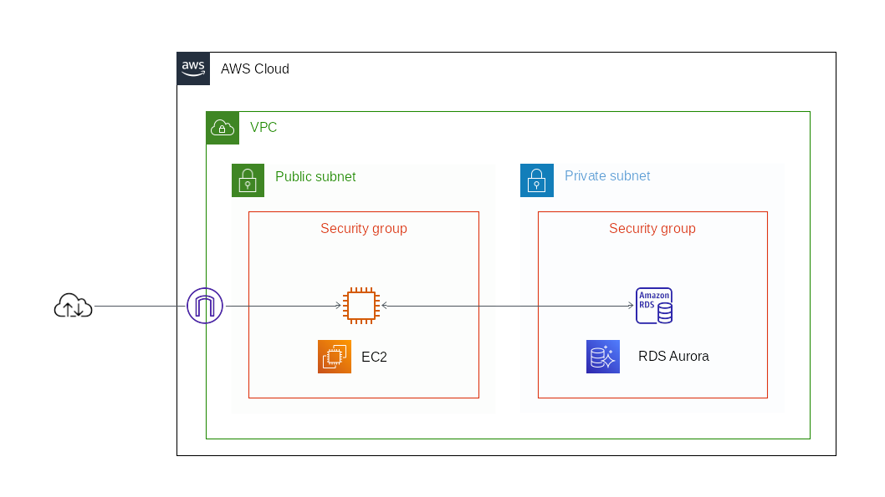

# ネットワーキングとコンテンツ配信

## 目次

1. [VPC](#vpc)
	1. [IPアドレス](#ipアドレス)
	1. [サブネット](#サブネット)
	1. [ルートテーブル](#ルートテーブル)
	1. [セキュリティグループ](#セキュリティグループ)
	1. [ネットワークACL](#ネットワークACL)
	1. [ゲートウェイ](#ゲートウェイ)
	1. [VPCエンドポイント](#vpcエンドポイント)
	1. [ピアリング接続](#ピアリング接続)
	1. [VPCフローログ](#vpcフローログ)
	1. [Direct Connect](#directo-connect)
1. [CloudFront](#cloudfront)
	1. [キャッシュルール](#キャッシュルール)
1. [Route53](#route53)
	1. [ドメイン管理](#ドメイン管理)
	1. [権威DNS](#権威dns)
	1. [ホストゾーンとレコード情報](#ホストゾーンとレコード情報)
	1. [トラフィックルーティング](#トラフィックルーティング)
	1. [トラフィックフロー](#トラフィックフロー)
	1. [DNSフェイルオーバー](#dnsフェイルオーバー)

## VPC

**VPC**（Amazon Virtual Private Cloud）はAWSのネットワークサービスの中心であり、利用者ごとのプライベートなネットワークをAWS内に作成する。VPCからインターネットへの出口を**インターネットゲートウェイ**（IGW）、VPCからオンプレミスの各拠点への出口を**仮想プライベートゲートウェイ**（VGW）という。

S3やCloudWatch、DynamoDBなど、VPCに入れられないサービスも多数あるので注意する。

### IPアドレス

VPCには自由なIPアドレス（CIDRブロック）をアサインできる。この時、ネットワーク部（ネットワーク空間）をできるだけ大きなサイズ（/16）で作成すると後々の拡張性が向上する。

### サブネット

**サブネット**は、VPC内部でさらにアドレスを分割するために用いられる。AZを指定して作成し、サブネットごとに**ルートテーブル**、**ネットワークACL**（Access Contorol List）を1つだけ指定する。

インターネット上に公開するものを**パブリックサブネット**、VPC内部で用いるものを**プライベートサブネット**と呼ぶ。

### ルートテーブル

宛先アドレスとターゲットとなるゲートウェイ（ネクストホップ）を指定した情報をまとめた表を**ルートテーブル**という。ルーティングには、静的にルートテーブルに記載する方法（スタティックルーティング）と、**ルート伝搬**（**プロパゲーション**）機能で動的に反映する方法（ダイナミックルーティング）がある。

### セキュリティグループ

**セキュリティグループ**は、EC2やELB、RDSなど、インスタンス単位の通信制御に利用される。**インバウンド**（外部からVPC）と**アウトバウンド**（VPCから外部）の両方を制御することが可能。制御項目は、プロトコルやポート範囲、送受信先のCIDR（IPアドレス）もしくはセキュリティグループなど。デフォルトではすべての通信を拒否する。

セキュリティグループはステートフルで、応答トラフィックはルールに関係なく通信が許可される。

### ネットワークACL

**ネットワークACL**（Access Control List）は、サブネットごとの通信制御に利用される。制御項目はセキュリティグループとほぼ同じ。デフォルトではすべての通信を許可する。

ネットワークALCはステートレスで、応答トラフィックであろうと明示的に許可設定をしていないと通信遮断してしまう。

### ゲートウェイ

**インターネットゲートウェイ**（IGW）は、VPCとインターネットを接続するゲートウェイで、各VPCにひとつだけアタッチ可能。**単一障害点**（**SPOF**、Single Point Of Failure）となる懸念があるが、実際は冗長化や障害時の復旧が自動的に行われる。

パブリックサブネットはルーティングでインターネットゲートウェイを向いているもの、プライベートサブネットはルーティングで直接インターネットゲートウェイに向いていないものとなる。

EC2インスタンスがインターネットと通信するには、パブリックIPを持っているか、**NATゲートウェイ**を経由する必要がある。

**仮想プライベートゲートウェイ**（VPG）は、VPCがVPNやDirect Connectと接続するためのゲートウェイ。

### VPCエンドポイント

VPCからインターネット上のAWSサービスに接続するには、IGWか**VPCエンドポイント**を利用する。

S3やDynamoDBと接続する際には、ルーティングを利用した**ゲートウェイエンドポイント**を用いる。それ以外の多数のサービスと接続するには**インタフェースゲートポイント**（**AWS PrivateLink**）を用いる。

### ピアリング接続

**VPCピアリング**は、2つのVPC間でプライベートな接続をするための機能。EC2インスタンスなどとは通信できるが、IGWやVGWには**トランジット**（接続）できない。

### VPCフローログ

**VPCフローログ**（VPC Flow Logs）はVPC内の通信の解析に用いる。VPCフローログは、AWSの仮想ネットワークインタフェースカードである**ENI**（Elastic Network Interface）単位で記録される。

### Direct Connect

**AWS Direct Connect**は、AWSとオフィスやデータセンターなどの物理的拠点とを専用線でつなげたい場合のサービス。**Direct Connect Gateway**を利用すると、1つのDirect Connect接続で拠点と複数のAWSアカウントやVPCに接続することができる。また、**AWS Transit Gateway**は、複数のVPCとオンプレミスネットワークを中央ハブを介して接続するサービスである。

## CloudFront

**Amazon CloudFront**は、HTMLファイルやCSS、画像、動画といった静的コンテンツをキャッシュし、**バックエンドサーバ**（**オリジンサーバ**）の代わりに配信する**CDN**（Contents Delivery Network）サービスである。オリジンサーバとしては、EC2やELB、S3の静的ホスティング、オンプレミスサーバを利用することができる。

CloudFrontを利用することで、ユーザは最も近い**エッジロケーション**からコンテンツを取得することができるため、**レイテンシー**（ファイルの最初のバイトがロードされるまでの時間）を最小化することができる。

### キャッシュルール

CDNではキャッシュの扱いがとても重要で、頻繁に更新されるコンテンツのキャッシュ期間は短く設定しておく必要がある。

## Route 53

**Amazon Route 53**は、ドメイン管理機能とDNS機能を持つサービス。

### ドメイン管理

Route 53で新規ドメインの取得や更新などの手続きができる。ドメインの取得から**ゾーン情報**（権威DNSが管理する変換情報や設定）まで、Route 53で一貫した管理が可能になる。

### 権威DNS

**権威DNS**は、ドメイン名とIPアドレスの変換情報を保持しているDNSのことで、変換情報を保持していない**キャッシュDNS**と区別される。

### ホストゾーンとレコード情報

**ホストゾーン**はレコード情報の管理単位を表し、通常はドメイン名である。**レコード情報**は、ドメイン名とIPアドレスを変換するための情報。

レコード情報には、**Aレコード**、**MXレコード**、**CNAMEレコード**などがある。Route53の特徴的なレコードである**Aliasレコード**は、登録する値としてCluodFrontやELB、S3などのAWSリソース**FQDN**（Fully Qualified Domain Name、ホスト名やドメイン名などをすべて省略せずに指定した記述形式）、Zone Apexを指定できる。**Zone Apex**は、最上位ドメインのこと。

### トラフィックルーティング

Route 53にゾーン情報を登録する際に、名前解決の問い合わせに対する応答を決めるための、7種類のルーティングポリシーがある。

- **シンプルルーティングポリシー** 特別なルーティングポリシーを使わない、1対1のルーティング。
- **フェイルオーバールーティングポリシー** アクティブ/スタンバイ方式で、アクティブ側へのヘルスチェックが失敗したときにスタンバイ側のシステムへルーティングする。本番システム障害時に**Sorryサーバ**（Webサイトやサービスが停止していることを知らせるサーバ）のIPアドレスをセカンダリレコードとして登録しておくなどの使い方。
- **位置情報ルーティングポリシー** ユーザの位置情報に基づいてトラフィックをルーティングする。
- **地理的近接性ルーティングポリシー** リソースの場所に基づいてトラフィックをルーティングする。
- **レイテンシールーティングポリシー** 遅延が最も少ないサーバにリクエストをルーティングする。
- **複数値回答ルーティングポリシー** 1つのレコードに異なるIPアドレスを複数登録して、ランダムに返却されたIPアドレスに接続する。ヘルスチェックがNGになったIPアドレスは返却されない。
- **加重ルーティングポリシー** 指定した比率で複数のリソースにトラフィックをルーティングする。

### トラフィックフロー

**トラフィックフロー**は、複雑なルーティングポリシーをビジュアル化して、設定/管理するためのソリューション。

### DNSフェイルオーバー

**DNSフェイルオーバー**は、Route 53が持つフォールトトレラントアーキテクチャ。**フォールトトレラントアーキテクチャ**とは、システムに異常が発生した場合でも被害を最小限に抑えるための仕組みのことを指す。

ヘルスチェックの結果を見てSorryサーバに切り替えるなどの処理を発動できる。
