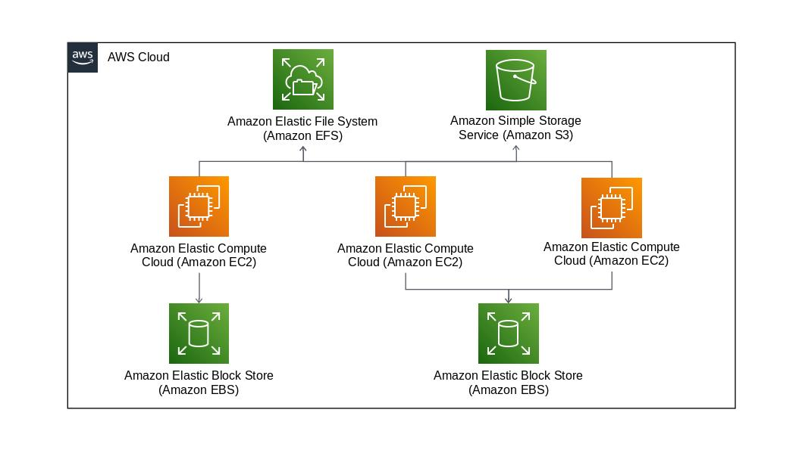

# ストレージ

## 目次

1. [EBS](#ebs)
	1. [ボリュームタイプ](#ボリュームタイプ)
	1. [バースト性能](#バースト性能)
	1. [EBSの拡張と可用性とセキュリティ](#ebsの拡張と可用性とセキュリティ)
	1. [EBSマルチアタッチ](#ebsマルチアタッチ)
1. [EFS](#efs)
	1. [EFSの構成要素](#efsの構成要素)
	1. [パフォーマンスモード](#パフォーマンスモード)
	1. [スループットモード](#スループットモード)
1. [S3](#s3)
	1. [S3の構成要素](#s3の構成要素)
	1. [S3の耐久性と整合性](#s3の耐久性と整合性)
	1. [ストレージクラス](#ストレージクラス)
	1. [ライフサイクル管理](#ライフサイクル管理)
	1. [バージョニング機能](#バージョニング機能)
	1. [Webサイトホスティング機能](#webサイトホスティング機能)
	1. [S3のアクセス管理](#s3のアクセス管理)
	1. [署名付きURL](#署名付きurl)
	1. [データ暗号化](#データ暗号化)
	1. [ブロックパブリックアクセス機能](#ブロックパブリックアクセス機能)
	1. [S3のその他の機能](#s3のその他の機能)
1. [S3 Glacier](#s3-glacier)
	1. [S3 Glacierの構成要素](#s3-glacierの構成要素)
	1. [データの取り出しオプション](#データの取り出しオプション)
	1. [S3 Glacier Select](#s3-glacier-select)
	1. [削除禁止機能](#削除禁止機能)
1. [Storage Gateway](#storage-gateway)
	1. [Storage Gatewayのタイプ](#storage-gatewayのタイプ)
	1. [ファイルゲートウェイ](#ファイルゲートウェイ)
	1. [ボリュームゲートウェイ](#ボリュームゲートウェイ)
	1. [テープゲートウェイ](#テープゲートウェイ)
	1. [Storage Gatewayのセキュリティ](#storage-gatewayのセキュリティ)
1. [FSx](#fsx)
	1. [FSx for Windowsファイルサーバ](#fsx-for-windowsファイルサーバ)
	1. [FSx for Lustre](#fsx-for-lustre)

## EBS

**Amazon EBS**（Elastic Block Store）は、AWSが提供するブロックストレージサービスである。EC2のOS領域として利用したり、追加ボリュームとして複数のEBSをEC2にアタッチすることもできる。**RDS**のデータ保存用にも用いられる。

EBSはEC2と1対1で対応するサービスである。複数のEC2にアタッチする**マルチアタッチ機能**もあるが、制約が多い。また、EBSは同じAZ内にあるEC2にしかアタッチすることはできず、別のAZのEC2にアタッチしたい場合は、EBSのスナップショットを取得して新しいEBSボリュームをEC2と同じAZ内に作る必要がある。

### ボリュームタイプ

SSDとHDDそれぞれにボリュームタイプの種類があり、それに加えて旧世代のHDDストレージタイプとして**マグネティックタイプ**がある。各タイプの性能を最大限発揮するためには、[EBS最適化インスタンスオプション](./04_computing.md#ec2における性能)のついたEC2を利用することが推奨される。

**汎用SSD**（gp2、gp3）は、EBSの中で最も一般的なボリュームタイプ。性能の指標として**IOPS**（1秒あたりに処理できるI/Oアクセス数）を用い、容量に応じた**ベースライン性能**がある。容量が少ないボリュームには、一時的なIOPSの上昇に対応できるように**バースト機能**が用意されている。

**プロビジョンドIOPS SSD**（io1）は、EBSの中で最も高性能なボリュームタイプ。RDSやEC2インスタンスでデータベースサーバを構成する場合など、高いIOPS性能が求められる場合や、高いスループットが必要なユースケースに適している。

**スループット最適化HDD**（st1）は、HDDをベースとしたスループット重視のボリュームタイプ。ログデータに対する処理やバッチ処理のインプット用ファイルなど、大容量ファイルを高速に読み取るようなユースケースに適している。性能指標として**スループット**を用いている。

**Cold HDD**（sc1）は、性能は高くはないが最も低コストなボリュームタイプ。利用頻度が少なく、アクセス時の性能も求められないデータに**シーケンシャルアクセス**（端から順番にアクセスする、⇔ **ランダムアクセス**）するようなユースケース、あるいはアーカイブ領域の用途に適している。

### バースト性能

ストレージサービスにはベースライン性能のほかに、**バースト性能**という指標がある。バースト性能はあくまで一時的な処理量の増加への対応性能であるため、バースト性能に頼ったサイジングはしないように注意する。

### EBSの拡張と可用性とセキュリティ

EBSはディスク容量が不足したら必要に応じて何度でもサイズを拡張できる（縮小はできない）。また、ボリュームタイプの変更も可能である。

EBSは内部的にAZ内の複数の物理ディスクに複製が行われており、物理的な故障が発生した場合でも利用者が対策を意識する必要はない。EBSには**スナップショット**機能もあるため、定期的にバックアップを取得することもできる。

また、EBSにはストレージ自体を暗号化するオプションが用意されている。ボリュームだけでなく、スナップショットも暗号化される。

### EBSマルチアタッチ

**Amazon EBSマルチアタッチ**は、制約は多いものの、複数のEC2インスタンスに同一のEBSをアタッチできるという機能。ただし、同一のAZのインスタンスからのみアタッチ可能で、書き込みの排他制御を利用者自身で検討する必要がある。

## EFS

**Amazon EFS**（Elastic File System）は、容量無制限で複数のEC2インスタンスから同時にアクセスできるファイルストレージサービス。クライアントからEFSへの接続は、一般的な**NFS**（Network File System）プロトコルをサポートしている。**amazon-efs-utils**ツールを使うと、EFSへのマウントに関する推奨オプションが含まれていたり、ファイルシステムにトラブルが発生した場合のトラブルシューティングに役立つログが記録できたりする。

### EFSの構成要素

EFSは、ファイルシステム、マウントターゲット、セキュリティグループの3つの要素で構成されている。

EFSはファイルが作成されると3か所以上のAZに保存される**分散ファイルシステム**を構成する。

作成したファイルシステムにアクセスするために、AZごとにサブネットを指定して**マウントターゲット**を作成する。マウントターゲットを作成すると、**ターゲットポイント**（接続FQDN）が1つとマウントターゲット用のIPアドレスが発行される。EC2からは1つのFQDNでアクセスするが、内部的にはレイテンシーが低くなるように近くのAZのマウントターゲットIPアドレスが返却される。

また、マウントターゲットには**セキュリティグループ**を指定でき、不要なアクセスを制限できる。

### パフォーマンスモード

EFSには、**汎用パフォーマンスモード**と**最大I/Oパフォーマンスモード**がある。通常は汎用パフォーマンスモード、数百～数千台といったクライアントから同時にEFSにアクセスするようなユースケースでは最大I/Oパフォーマンスモードを用いる。

どちらのモードを用いるかの指標として、[CloudWatch](./05_management_and_governance.md#cloudwatch)の**PercentIOLimit**というメトリクスが参考になる。汎用パフォーマンスモードでPercentIOLimitが長時間高い状態であれば、最大I/Oパフォーマンスモードに変更することを検討するとよい。

パフォーマンスモードは後から変更できないので注意する。

### スループットモード

EFSには、バーストスループットモードとプロビジョニングスループットモードがある。

**バーストスループットモード**は、EFSに保存されているデータ容量に応じてベースラインとなるスループットが設定されている。一時的なスループットの上昇にも耐えられるようなバースト機能を持ったモードとなっている。

**プロビジョニングスループットモード**は、バーストスループットモードで設定されているベースラインスループットやバースト時の最大スループットでは性能が足りない場合に、任意のスループット値を指定することができるモード。Web配信コンテンツやアプリケーションデータなどの頻繁なアクセスが見込まれる場合に有用。

どちらのモードを用いるかの指標として、[CloudWatch](./05_management_and_governance.md#cloudwatch)の**BurstCreditBalance**というメトリクスが参考になる。クレジットバランスをすべて使い切ってしまったり、常に減少傾向である場合にはプロビジョニングスループットモードを選択する。

スループットモードはあとから変更できる。

## S3

**Amazon S3**（Simple Storage Service）は、高い耐久性を持つ容量無制限のオブジェクトストレージサービス。S3の各オブジェクトには、[REST](../web/03_rest.md)やSOAPといったHTTPベースのWeb APIを使ってアクセスする。柔軟性に優れており、アイデア次第で様々な利用方法がある。

- データバックアップ
- ビックデータ解析用のデータレイク
- [ETL](./12_analytics.md#etlツール)（Extract/Transform/Load）の中間ファイル保存
- Auto Scaling構成されたEC2インスタンスやコンテナからのログ転送先
- 静的コンテンツのホスティング
- Key-Value型のデータベース

### S3の構成要素

S3の構成要素は以下の通り。

**バケット**は、オブジェクトを保存するための領域。バケット名はAWS内で一意である必要がある。

**オブジェクト**は、S3に格納されるデータそのもの。各オブジェクトにはキーが付与され、「バケット名 + キー名 + バージョンID」で必ず一意になるURLが作成される。

**メタデータ**は、オブジェクトを管理するための情報。アプリケーションで必要な情報をユーザ定義メタデータとして保持することもできる。

### S3の耐久性と整合性

S3に保存されたデータは、複数のAZ、AZ内の複数の物理的なストレージに複製され、高い耐久性が維持されるようになっている。データの複製方式には、**結果整合性方式**を採用している。そのため、データの保存後
に複製が完全に終わるまでの間にデータを参照すると、保存前の状態が表示されることもあるので注意が必要。

### ストレージクラス

S3には用途に応じてランク分けされた**ストレージクラス**がある。可用性の性能には**SLA**（Service Level Agreement）が設定されている。

- **S3標準**は、デフォルトのストレージクラス。
    - 耐久性： 99.999999999%（イレブンナイン）
    - 可用性： 99.99%
- **S3標準 - 低頻度アクセス**は、格納コストが安価なストレージクラス。データの読み出し容量に対する従量課金が行われる。
    - 耐久性： 99.999999999%（イレブンナイン）
    - 可用性： 99.9%
- **S3 1ゾーン - IA**は、単一のAZ内のみでデータを複製するストレージクラス。
    - 耐久性： 99.999999999%（イレブンナイン）
    - 可用性： 99.5%
- **S3 Intelligent - Tiering**は、参照頻度の高低を明確に決めることができないデータを扱う場合に有効なストレージクラス。S3標準とS3標準 - 低頻度アクセスの2層構成となっている。
    - 耐久性： 99.999999999%（イレブンナイン）
    - 可用性： 99.9%
- **S3 Glacier**は、ほとんど参照されないアーカイブ目的のデータを保存するストレージクラス。新規作成時に選択することはできず、ライフサイクル管理機能によって利用可能となる。データへのアクセスには事前にリクエストが必要で、アクセスできるようになるまで時間がかかる。
    - 耐久性： 99.999999999%（イレブンナイン）
    - 可用性： 99.99%
- **S3 Glacier Deep Archive**は、S3 Glacier同様アーカイブ用のストレージクラス。さらにアクセス頻度が低いデータを想定している。
    - 耐久性： 99.999999999%（イレブンナイン）
    - 可用性： 99.99%

### ライフサイクル管理

S3に保存されたオブジェクトはその利用頻度に応じて**ライフサイクル**を定義することができる。

**移行アクション**は、データの利用頻度に応じてストレージクラスを変更するアクション。

**有効期限アクション**は、指定された期限を超えたオブジェクトをS3から削除するアクション。

### バージョニング機能

**バージョニング機能**を有効にすると、1つのオブジェクトに対して複数のバージョンを管理することができる。バージョン管理を行うと、オブジェクトは差分管理されるのではなく、新・旧オブジェクトの両方が保存されるようになる。

### Webサイトホスティング機能

S3では、静的なコンテンツに限ってWebサイトとしてホスティングする環境を作成できる。RubyやPython、PHP、Perlなど、サーバサイドの動的なコンテンツに関してはホスティングできない。

### S3のアクセス管理

S3のアクセス管理には、バケットポリシー、ACL、IAMが使える。

|                                | バケットポリシー | ACL  | IAM  |
| ------------------------------ | :--------------: | :--: | :--: |
| AWSアカウント単位の制御        |        〇        |  〇  |  ×   |
| IAMユーザ単位の制御            |        △         |  ×   |  〇  |
| S3バケット単位の制御           |        〇        |  〇  |  〇  |
| S3オブジェクト単位の制御       |        〇        |  〇  |  〇  |
| IPアドレス・ドメイン単位の制御 |        〇        |  ×   |  〇  |

**バケットポリシー**はバケット単位でアクセスを制御する。バケットの用途に応じた全体的なアクセス制御をするときに有効。

**ACL**（Access Control List）はオブジェクト単位で公開/非公開を制御する場合に使用する。

**IAM**はユーザ単位でS3のリソースを制御する場合に使用する。

### 署名付きURL

**署名付きURL**は、アクセスを許可したいオブジェクトに対して期限を指定してURLを発行する機能。バケットやオブジェクトのアクセス制御を変更することなく特定のオブジェクトに一時的にアクセスを許可したい場合に有効。署名付きURLを知っている人はだれでもオブジェクトにアクセスできる。

### データ暗号化

S3に保存するデータは暗号化できる。**サーバ側での暗号化**では、データがストレージに書き込まれるときに暗号化され、読み出されえるときに復号される。**クライアント側での暗号化**では、AWS SDKを使ってS3に送信する前にデータが暗号化される。

### ブロックパブリックアクセス機能

**ブロックパブリックアクセス機能**は、新規・任意のACLおよびバケットポリシーの4段階でパブリックアクセスを禁止する設定ができる。

また、**S3 Access Analyzer**は、S3バケットの監視・保護ができる。

### S3のその他の機能

**S3 Select**は、SQL文を利用してS3オブジェクトのコンテンツをフィルタリグし、必要なデータのみを取得する機能。

**S3 Transfer Acceleration**は、遠隔地のS3へのデータ転送をサポートする機能。

## S3 Glacier

**Amazon S3 Glacier**は、S3と同様に**イレブンナイン**の耐久性を持ちながらもコストを抑えた、アーカイブストレージサービス。データの取り出しには時間がかかるため、アクセス頻度が低いデータなど限られたユースケースにのみ使用可能。

### S3 Glacierの構成要素

S3 Glacierの構成要素は以下の通り。

**ボールト**は、アーカイブを保存するための領域で、S3のバケットに相当する。

**アーカイブ**は、S3 Glacierに格納されるデータのこと。

**インベントリ**は、各ボールトに保存されているアーカイブの情報を収集し、1日1回の頻度で更新される。リアルタイムで状況を確認したい場合は、マネジメントコンソールで確認するか、**ListVaults** APIを実行する。

**ジョブ**は、アーカイブやインベントリに対して検索をかけたり、データをダウンロードするといった要求に対して処理を実行し、処理の状況を管理する。

### データの取り出しオプション

S3 Glacierにアーカイブしたデータを閲覧する際、データの取り出しまでにかかる待ち時間に応じて、**高速**、**標準**、**バルク**といったリクエストオプションがある。

### S3 Glacier Select

**S3 Glacier Select**はアーカイブデータに対してSQLを実行して、条件に合ったデータを抽出する機能。

### 削除禁止機能

S3 Glacierの**削除禁止機能**（**ボールトロック**）を利用して、AWSの機能を使ってアーカイブを削除できないようにする方法がある。ボールトロックポリシーを設定することで、ユーザにアーカイブを削除する権限を拒否する。

## Storage Gateway

**AWS Storage Gateway**は、オンプレミスにあるデータをクラウドへ連携するための受け口を提供するためのサービス。データの保存先としてはS3やS3 Glacierなどの耐久性が高く低コストなストレージが利用されることが多い。

### Storage Gatewayのタイプ

Storage Gatewayには、**ファイルゲートウェイ**、**ボリュームゲートウェイ**、**テープゲートウェイ**といった種類がある。さらにボリュームゲートウェイには、**キャッシュ型ボリューム**と**保管型ボリューム**という管理方法の分類もある。

### ファイルゲートウェイ

**ファイルゲートウェイ**は、S3をクライアントサーバからNFSマウントして、ファイルシステムのように扱うことができるゲートウェイ。作成したファイルは、非同期（ほぼリアルタイム）でS3にアップロードされる。

### ボリュームゲートウェイ

**ボリュームゲートウェイ**は、各ファイルをオブジェクトとして管理するのではなく、S3のデータ保存領域全体を1つのボリュームとして管理する。クライアントサーバからのゲートウェイへの接続方式は、iSCSI接続になる。

**キャッシュ型ボリューム**では、頻繁に利用するデータはStorage Gateway内のキャッシュディスク（オンプレミス）に保存して、すべてのデータを保存するストレージ（**プライマリストレージ**）としてS3を利用する。オンプレミスの**キャッシュボリューム**に頻繁に使用するデータを、**アップロードバッファボリューム**にS3にアップロードするデータを保管しておく。

**保管型ボリューム**では、すべてのデータを保存するストレージとしてローカルストレージを利用し、データを定期的にスナップショット形式でS3へ転送する。オンプレミスのデータを定期的にバックアップする用途に適している。

### テープゲートウェイ

**テープゲートウェイ**は、テープデバイスの代替としてS3やS3 Glacierにデータをバックアップするタイプのゲートウェイ。すでにバックアップにテープデバイスを利用している場合は、Storage Gatewayへの移行が可能。

### Storage Gatewayのセキュリティ

**CHAP認証**（Challenge-Handshake Authentication Protocol）は、クライアントからStorage Gatewayに**iSCSI**（Internet Small Computer System Interface）で接続する際に設定することで、不正なクライアントからのなりすましを防止でき、通信の盗聴といった脅威に対するリスクを軽減できる。

データは、[AWS KMS](./08_security_and_identity.md#kmsとcloudhsm)を使ってS3に保存されるタイミングで暗号化される。

また、オンプレミス環境からStorage Gatewayを経由してS3にデータを転送する際にHTTPSが使用されるため、**通信の暗号化**も行われる。

## FSx

**Amazon FSx**はフルマネージドなファイルストレージ。Windows向けのAmazon FSx for Windowsファイルサーバと、ハイパフォーマンスコンピューティング向けのAmazon FSx for Lustreがある。

### FSx for Windowsファイルサーバ

**FSx for Windowsファイルサーバ**は、Windows用のフルマネージドなファイルサーバ。Windowsで利用できるユーザクォータ、エンドユーザファイルの復元、Microsoft Active Directory統合などの幅広い機能が利用可能。単一のサブネットにエンドポイントとなるENI（Elastic Network Interface）を配置し、SMBプロトコルを介してアクセス可能。

### FSx for Lustre

**FSx for Lustre**はフルマネージドな分散ファイルシステム。Lustreはファイルシステム作成時にS3のバケットと関連付けする。S3上のファイルをインデックスし、あたかも自前のファイルのように見せる。高速なデータアクセスが必要なハイパフォーマンスコンピューティングで利用され、機械学習やビッグデータ処理に使われる。
