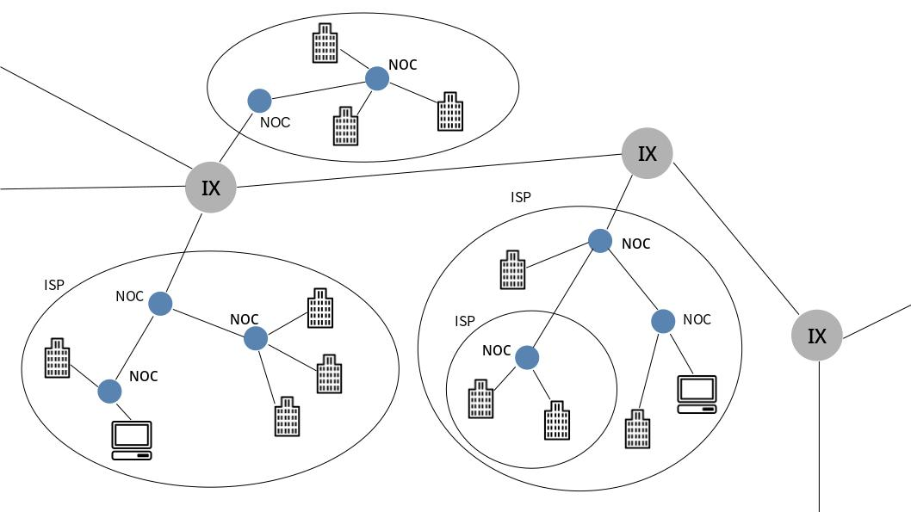

# インターネットの基礎知識

## 目次

1. [ネットワークの基本用語](#ネットワークの基本用語)
	1. [LANとWAN](#lanとwan)
	1. [パケット交換](#パケット交換)
1. [プロトコル](#プロトコル)
	1. [ネットワークアーキテクチャ](#ネットワークアーキテクチャ)
1. [通信方式](#通信方式)
	1. [コネクション型とコネクションレス型](#コネクション型とコネクションレス型)
	1. [通信相手の数による通信方式の分類](#通信相手の数による通信方式の分類)
1. [アドレス](#アドレス)
	1. [アドレスとNIC](#アドレスとnic)
1. [ネットワークの基本構成要素](#ネットワークの基本構成要素)
	1. [リピーター](#リピーター)
	1. [ブリッジ](#ブリッジ)
	1. [ルーター](#ルーター)
	1. [レイヤ4-7スイッチ](#レイヤ4-7スイッチ)
	1. [ゲートウェイ](#ゲートウェイ)
1. [ネットワークの全体像](#ネットワークの全体像)
	1. [ネットワークの構成](#ネットワークの構成)
	1. [携帯端末による通信](#携帯端末による通信)
	1. [データセンター](#データセンター)
1. [インターネット](#インターネット)
	1. [インターネットの意味](#インターネットの意味)
	1. [インターネットの構造](#インターネットの構造)
1. [クラウド](#クラウド)
	1. [仮想化とクラウド](#仮想化とクラウド)
	1. [クラウドの利用](#クラウドの利用)

## ネットワークの基本用語

### LANとWAN

**LAN**（Local Area Network）は、フロア内、建物内、キャンバス内などの狭い地域の中でのネットワークのこと。

**MAN**（Metropolitan Area Network）は、WANよりも狭い、都市レベルのネットワークのこと。あまり使われることはない。

**WAN**（Wide Area Network）は、地理的に離れた広範囲に及ぶネットワークのこと。

### パケット交換

通信において、大きなデータを**パケット**（Packet）と呼ばれる単位に分けて送信する技術を**パケット交換**という。

それまでの**回線交換**では、一度コネクションを確立すると、コネクションが切断されるまでその回線が占有利用されるという欠点があった。

## プロトコル

コンピュータとコンピュータがネットワークを介して通信を行う際の決まり事のことを**プロトコル**という。

### ネットワークアーキテクチャ

**ネットワークアーキテクチャ**とは、様々なプロトコルを体系的にまとめたもののこと。

## 通信方式

### コネクション型とコネクションレス型

**コネクション型**は、通信をする前にコネクションを確立する通信方式。

**コネクションレス型**は、相手がいるかどうかを確認せずに送信者の都合でデータを送り付ける方式。

### 通信相手の数による通信方式の分類

**ユニキャスト**は、1対1の通信のことを指す。1を意味する「Uni」と、投げるを意味する「Cast」を組み合わせた言葉。従来の電話が代表例。

**ブロードキャスト**は、すべての[ホスト](./07_internet_layer.md#ホストとルーターとノード)を対象としてデータを送信する。不特定多数に向かって一斉配信を行うテレビ放送が代表例。

**マルチキャスト**は、特定のグループ内での通信を指す。限定された複数の[ホスト](./07_internet_layer.md#ホストとルーターとノード)が接続するビデオ会議が代表例。

**エニーキャスト**は、特定のグループ内のいずれか1つのコンピュータとの通信を指す。ネットワーク上で、条件を満たした[ホスト](./07_internet_layer.md#ホストとルーターとノード)の中からどれか1つと通信を行う。

## アドレス

### アドレスとNIC

通信相手の唯一性を保証する識別子のことを**アドレス**という。プロトコルの各レイヤでそれぞれにアドレスがあり、TCP/IPでは、**IPアドレス**、**MACアドレス**、**ポート番号**が用いられている。

**NIC**（Network Interface Card）は、コンピュータをネットワークに接続するときに使う部品で、MACアドレスが定められている。

## ネットワークの基本構成要素

| 機器の名称                         | 役割                                                     |
| ---------------------------------- | -------------------------------------------------------- |
| ネットワークインターフェース       | コンピュータをネットワークに接続するための装置           |
| リピーター（Repeater）             | ネットワークを物理層で延長する装置                       |
| ブリッジ（Bridge） レイヤ2スイッチ | ネットワークをデータリンク層で延長する装置               |
| ルーター（Router） レイヤ3スイッチ | ネットワーク層によってパケットを転送する装置             |
| レイヤ4-7スイッチ                  | トランスポート層より上の情報でトラフィックを処理する装置 |
| ゲートウェイ（Gateway）            | プロトコルの変換をする装置                               |

### リピーター

**リピーター**は、[OSI参照モデル](./04_osi_reference_model.md)の[物理層](./04_osi_reference_model.md#物理層)でネットワークを延長する機器。ケーブル上を流れてきた電気信号の増幅や整形などを行う。

### ブリッジ

**ブリッジ**は、[OSI参照モデル](./04_osi_reference_model.md)の[データリンク層](./04_osi_reference_model.md#データリンク層)でネットワークを延長する装置。データリンクのフレームを認識してブリッジ内部のメモリにいったん蓄積し、接続された相手のセグメントにフレームを送出する（**ストア&フォワード方式**）。

データリンクのフレームには、フレームが正しく届いたかどうかをチェックするための**FCS**（Frame Check Sequence）と呼ばれるフィールドがある。ブリッジではFCSをチェックして、壊れたフレームを別のセグメントに送信しないようにする働きがある。FCSは**CRC**（Cyclic Redundancy Check）と呼ばれる方式によってチェックされる。

また、アドレスの学習機能を備えたブリッジを**ラーニングブリッジ**と呼ぶ。

### ルーター

**ルーター**は、[OSI参照モデル](./04_osi_reference_model.md)の[ネットワーク層](./04_osi_reference_model.md#ネットワーク層)でパケットを中継する装置。[イーサネット](./06_datalink_layer.md#イーサネット)と[イーサネット](./06_datalink_layer.md#イーサネット)や、[イーサネット](./06_datalink_layer.md#イーサネット)と[無線LAN](./06_datalink_layer.md#無線LAN)といった、異なる[データリンク](./06_datalink_layer.md#データリンクの概要)を相互に接続できる。ネットワークの負荷を仕切る役割りや、セキュリティ機能を備えたものもある。

### レイヤ4-7スイッチ

[OSI参照モデル](./04_osi_reference_model.md)の[トランスポート層](./04_osi_reference_model.md#トランスポート層)から[アプリケーション層](./04_osi_reference_model.md#アプリケーション層)の情報に基づいた配送処理を行う装置のことを**レイヤ4-7スイッチ**という。負荷分散のために複数のサーバを設置してリクエストを捌いているシステムでは、レイヤ4-7スイッチの一種である**ロードバランサー**が使用される。

また、インターネットを経由した外部からの不正なアクセスを防止するための**ファイアウォール**もレイヤ4-7スイッチ。

### ゲートウェイ

**ゲートウェイ**は、[OSI参照モデル](./04_osi_reference_model.md)の[トランスポート層](./04_osi_reference_model.md#トランスポート層)から[アプリケーション層](./04_osi_reference_model.md#アプリケーション層)までの階層で、データを変換して中継する装置。2つの異なる[プロトコル](#プロトコル)間での翻訳作業を行う。

また、ネットワークトラフィックの軽減やセキュリティ強化のために利用される**代理サーバー**（Proxy Server）は、**アプリケーションゲートウェイ**とも呼ばれる。

## ネットワークの全体像

### ネットワークの構成

ネットワークの中心的存在で、大量のデータを高速に送受信することを目的に構築された部分を**バックボーン**や**コア**と呼ぶ。これらは異なるエリアのネットワーク間をつなぐ役割を果たしている。

バックボーンと、あるエリアのネットワークとをつなぐ部分を**エッジ**と呼ぶ。エッジでは多機能[ルーター](#ルーター)などが利用されている。

エリア内のネットワークのうちエッジに接続されている部分を**アクセス**や**アグリゲーション**と呼ぶ。[LAN](#lanとwan)や[ルーター](#ルーター)で集約された通信はアクセス（アグリゲーション）に接続され、エッジやバックボーンを経て通信相手へと接続される。

### 携帯端末による通信

モバイル端末の電源を入れると、自動的に電波が発信されて最寄りの**基地局**と通信が行われる。基地局には、契約している**モバイルオペレータ**（携帯電話提供会社）のアンテナが設置されており、これが[アクセス（アグリゲーション）](#ネットワークの構成)に相当する。

基地局に集められた情報は、**局舎**（[エッジ](#ネットワークの構成)）に集約されて、局舎間の**基幹ネットワーク**（[バックボーン](#ネットワークの構成)）に接続される。

モバイル端末が移動した際に、自動的に基地局間で情報を交換して引き継いでいくことを、**ローミング**という。乗り物などで移動中のユーザが継続してインターネットを利用できるのはこの仕組みのおかげ。

### データセンター

SNSサイトなどにおいては世界中の大量のトラフィックを瞬時に処理する必要があるため、多くのストレージ機器やサーバを複数個所の専門施設に設置し、高速なネットワークで接続する必要がある。これらの情報処理専用施設のことを**データセンター**という。

データセンターは、巨大なサーバとストレージを持ち、大規模なデータセンターは直接[バックボーン](#ネットワークの構成)に接続されている。

## インターネット

### インターネットの意味

**インターネット**（Internet）は、[ARPANET](./02_history_of_the_internet.md#ARPANETの誕生)から発展した、全世界を接続しているコンピュータネットワークを指す言葉。インターネットの対比として、会社などの組織内部の閉じた通信サービスのためのネットワークを**イントラネット**（Intranet）と呼ぶ。

### インターネットの構造

インターネットは階層的な構造になっており、**バックボーン**と呼ばれる基幹ネットワークと、**スタブ**と呼ばれる末端ネットワークから構成される。

ネットワークとネットワークは、**NOC**（Network Operation Center）で接続される。また、ネットワークの運用者や運用方針、利用方針などが異なるネットワークを対等に接続するポイントは**IX**（Internet Exchange）と呼ばれる。インターネットは異なる組織のネットワークがIXによって相互に接続された巨大なネットワークといえる。

## クラウド

### 仮想化とクラウド

インターネットを利用したシステムが提供するコンテンツは、平日は利用者数が少ないが休日は利用者数が増える、1日の中でアクセスが多い時間帯と少ない時間帯がある、といったムラがある。こういったネットワーク資源のムダをなくすために生まれたのが**仮想化技術**である。これは、サーバーやストレージ、ネットワークを物理的に増やしたり減らしたりするのではなく、ソフトウェアを使って仮想的に必要な資源を割り当てる仕組みを指す。

仮想化技術を利用して、利用者にとって必要な資源を自動的に提供する仕組みを**クラウド**と呼ぶ。また、仮想化されたシステム全体を必要に応じて自動的に制御する仕組みを**オーケストレーション**（Orchestration）と呼ぶ。

### クラウドの利用

Office 365のように、クラウド上のアプリケーションを利用する形態を、**SaaS**（Software as a Service）と呼ぶ。データをインターネット上に保存し、様々なデバイスからアクセスできることから近年需要が高まっている。

また、クラウド上での開発を目的として、アプリケーションが稼働するためのハードウェアやOSなどのプラットフォーム一式を利用する形態のことを、**PaaS**（Platform as a Service）と呼ぶ。

さらには、システムの稼働に必要となるネットワークインフラの性能（CPUの能力やメモリの量、ストレージの量など）を自由に決定して利用する形態のことを、**IaaS**（Infrastructure as a Service）と呼ぶ。

今までは各企業や個人が独自にサーバなどのインフラを構築し、利用・運用する**オンプレミス**が主流であったが、現在はクラウドへの移行が盛んにおこなわれている。

クラウド構造の単純化や開発環境の簡素化、スピードアップを目的として、**Docker**や**Podman**などの**コンテナ**と呼ばれる技術も発展している。
