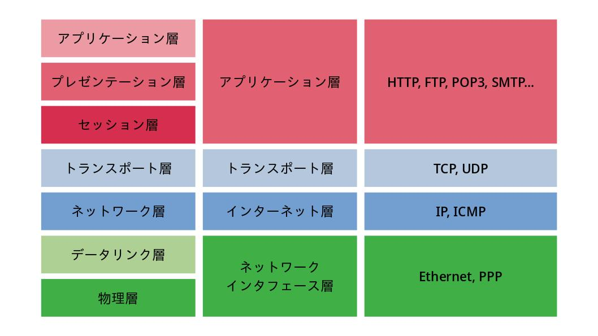

# TCP/IPの階層モデル

## 目次

1. [TCP/IPの階層モデル](#tcpipの階層モデル)
	1. [アプリケーション層](#アプリケーション層)
	1. [トランスポート層](#トランスポート層)
	1. [インターネット層](#インターネット層)
	1. [データリンク層](#データリンク層)
	1. [ハードウェア](#ハードウェア)
1. [TCP/IPにおける通信の流れ](#tcpipにおける通信の流れ)
	1. [各層でのパケット処理](#各層でのパケット処理)
	1. [TCPモジュールの処理](#tcpモジュールの処理)
	1. [IPモジュールの処理](#ipモジュールの処理)
	1. [ネットワークインタフェースの処理](#ネットワークインタフェースの処理)

## TCP/IPの階層モデル

[OSI参照モデル](./04_osi_reference_model#OSI参照モデル)は標準化団体[ISO](./03_standarization_of_tcpip.md#isoとietf)によって提唱されたが、TCP/IPは[IETF](./03_standarization_of_tcpip.md#isoとietf)によって実装された[プロトコル](./01_basic_knowledge_of_network.md#プロトコル)であるため、そのモデルは厳密には異なる。

TCP/IPでは、[インターネット層](./07_internet_layer.md)と[トランスポート層](./08_transport_layer.md)がOSに組み込まれていることを想定しており、その上でアプリケーションが[インターネット](./01_basic_knowledge_of_network.md#インターネット)に接続されているような構成となっている。

### アプリケーション層

TCP/IPのアプリケーションの多くは、**クライアント/サーバーモデル**で作られている。
サービスを提供するプログラムをサーバ、サービスを受けるプログラムをクライアントとして、サーバはいつでもクライアントの要求を受け取れるように常に起動しておく（このような常に起動して用いるプログラムを[デーモン](./09_application_layer.md#デーモン)と呼ぶ）。

**WWW**（World Wide Web）は、[インターネット](./01_basic_knowledge_of_network.md#インターネット)が一般に普及する原動力となったアプリケーションで、**Webブラウザ**と呼ばれるソフトウェアを通して、ネットワークの中にある様々な情報を閲覧することができる。ここで、ブラウザとサーバの間の通信に用いられる[プロトコル](./01_basic_knowledge_of_network.md#プロトコル)は**HTTP**（HyperText Transfer Protocol）で、送信に用いられる主なデータフォーマットは**HTML**（HyperText Markup Language）である。

**電子メール**（E-mail）は、ネットワーク上で郵便の仕組みを再現したものである。**SMTP**（Simple Mail Transfer Protocol）や**POP3**（Post Office Protocol Version 3）といった[プロトコル](./01_basic_knowledge_of_network.md#プロトコル)が用いられている。もともとはテキスト形式での電子メールが一般的であったが、現在は電子メールで送信できるデータ形式を拡張する**MIME**（Multipurpose Internet Mail Extensions）の仕様が整えられた。

**ファイル転送**は、異なるコンピュータのハードディスク上に存在するファイルを相互に転送することができるアプリケーション。**FTP**（FIle Transfer Protocol）という[プロトコル](./01_basic_knowledge_of_network.md#プロトコル)が用いられ、ファイルの転送を指示するための制御コネクションと、実際にデータを転送するためのデータコネクションという2つの[TCP](./08_transport_layer.md#tcp)コネクションを確立する。

**遠隔ログイン**は、遠く離れたコンピュータにログインして、そのコンピュータでプログラムを走らせることができるようにするための機能。**TELNET**（TELetypewriter NETwork）や**SSH**（Secure SHell）といった[プロトコル](./01_basic_knowledge_of_network.md#プロトコル)がよく用いられる。また、リモートデスクトップなどを用いる際は**RDP**が[プロトコル](./01_basic_knowledge_of_network.md#プロトコル)として用いられる。

**ネットワーク管理**には、**SNMP**（Simple Network Management Protocol）が用いられる。SNMPで管理される[ルーター](./01_basic_knowledge_of_network.md#ルーター)や[ブリッジ](./01_basic_knowledge_of_network.md#ブリッジ)、[ホスト](./07_internet_layer.md#ホストとルーターとノード)などを**エージェント**といい、これらを管理するプログラムを**マネージャ**という。エージェントは様々な情報を**MIB**（Management Information Base）という構造によって管理する。

### トランスポート層

トランスポート層はアプリケーションプログラム間の通信を実現する役割がある。そのため、どのプログラムがどのプログラムと通信しているかを識別するために、**ポート番号**と呼ばれる識別子を用いる。トランスポート層では以下の2つの代表的な[プロトコル](./01_basic_knowledge_of_network.md#プロトコル)が用いられる。

**TCP**（Transmission Control Protocol）は、[コネクション型](./01_basic_knowledge_of_network.md#コネクション型とコネクションレス型)で信頼性のある通信を実現するために用いられる。両端の[ホスト](./07_internet_layer.md#ホストとルーターとノード)間でのデータの到達性を保証する。経路の途中でパケットが失われたり順番が入れ替わったりしても、[TCP](./08_transport_layer.md#tcp)がそれを解決する。コネクションの確立・切断をするだけで制御のために7回もパケットをやり取りするため、データの転送量が少ない場合は無駄が多くなる。

**UDP**（User Datagram Protocol）は、[コネクションレス型](./01_basic_knowledge_of_network.md#コネクション型とコネクションレス型)でデータの到達に関して信頼性のない[プロトコル](./01_basic_knowledge_of_network.md#プロトコル)である。送信したデータが相手に届いているかどうかの確認は行わない。パケット数が少ない通信や、[ブロードキャスト](./01_basic_knowledge_of_network.md#通信相手の数による通信方式の分類)や[マルチキャスト](./01_basic_knowledge_of_network.md#通信相手の数による通信方式の分類)通信、ビデオや音声などの[マルチメディア](./01_basic_knowledge_of_network.md#通信相手の数による通信方式の分類)通信に向いている。

### インターネット層

**インターネット層**（ネットワーク層）の代表的な[プロトコル](./01_basic_knowledge_of_network.md#プロトコル)は[IP](./07_internet_layer.md#ip)で、[IPアドレス](./07_internet_layer.md#ipアドレス)をもとにしてパケットを転送する役割を担う。

**IP**（Internet Protocol）は、ネットワークをまたいでパケットを配送し、[インターネット](./01_basic_knowledge_of_network.md#インターネット)全体にパケットを送り届けるための[プロトコル](./01_basic_knowledge_of_network.md#プロトコル)。それぞれの[ホスト](./07_internet_layer.md#ホストとルーターとノード)を識別するために、**IPアドレス**と呼ばれる識別子を用いる。

**ICMP**（Internet Control Message Protocol）は、IPパケットの配送中に何らかの異常が発生してパケットを転送できなくなったときに、送信元に異常を知らせるために用いられる[プロトコル](./01_basic_knowledge_of_network.md#プロトコル)。

**ARP**（Address Resolution Protocol）は、パケットの送り先の[MACアドレス](./06_datalink_layer.md#macアドレス)を[IPアドレス](./07_internet_layer.md#ipアドレス)から取得する[プロトコル](./01_basic_knowledge_of_network.md#プロトコル)。

### データリンク層

データリンク層は**ネットワークインタフェース層**とも呼ばれ、[データフレーム](./06_datalink_layer.md#データリンクの概要)をネットワーク上で隣接するコンピュータに転送する役割をもつ。

具体的には、[NIC](./01_basic_knowledge_of_network.md#アドレスとnic)を動かすためのデバイスドライバのこと。OSが[NIC](./01_basic_knowledge_of_network.md#アドレスとnic)を認識して、そのカードを利用できるように設定する必要がある。

### ハードウェア

**物理層**としてデータリンク層とレイヤを分けることもある。

TCP/IPにおいて、物理的にデータを転送するケーブルや無線のこと。ネットワークにおける信頼性やセキュリティ、帯域、遅延時間については特に制限はない。

## TCP/IPにおける通信の流れ

### 各層でのパケット処理

TCP/IPでは、転送されるデータに対して各階層で**ヘッダ**と呼ばれる情報を付加していく。ヘッダにはその層の[プロトコル](./01_basic_knowledge_of_network.md#プロトコル)で必要となる情報が組み込まれている。

### TCPモジュールの処理

TCPヘッダには、送信[ホスト](./07_internet_layer.md#ホストとルーターとノード)と受信[ホスト](./07_internet_layer.md#ホストとルーターとノード)のアプリケーションを識別するための**ポート番号**、パケットが何バイト目のデータなのかを示す**シーケンス番号**、データが壊れていないことを証明する**チェックサム**などが含まれる。

データが正確に届けられた場合は、それを確認するための「**確認応答**」を返す。

[ポート番号](./08_transport_layer.md#ポート番号)は、[アプリケーション層](./09_application_layer.md)の[プロトコル](./01_basic_knowledge_of_network.md#プロトコル)を決定するために用いられている。

### IPモジュールの処理

IPヘッダには、宛先や送信元の**IPアドレス**、IPヘッダに続くデータが[TCP](./08_transport_layer.md#tcp)なのか[UDP](./08_transport_layer.md#udp)なのかを表す情報が含まれる。パケットは、**経路制御表**（ルーティングテーブル）をもとに次に渡す[ルーター](./01_basic_knowledge_of_network.md#ルーター)や[ホスト](./07_internet_layer.md#ホストとルーターとノード)が決定される。

通信先の機器の[MACアドレス](./06_datalink_layer.md#macアドレス)がわからない場合は、[ARP](./06_datalink_layer.md#arp)を利用して[MACアドレス](./06_datalink_layer.md#macアドレス)を調べる。

### ネットワークインタフェースの処理

パケットが物理層により送信される際、**FCS**（Frame Check Sequence）がハードウェアで計算される。これは、ノイズなどによりパケットが破壊されたことを検出するためのもの。

パケットを受け取った[ホスト](./07_internet_layer.md#ホストとルーターとノード)は、そのパケットの送り先の[MACアドレス](./06_datalink_layer.md#macアドレス)を調べ、自分宛てでなければそれを捨てる。
