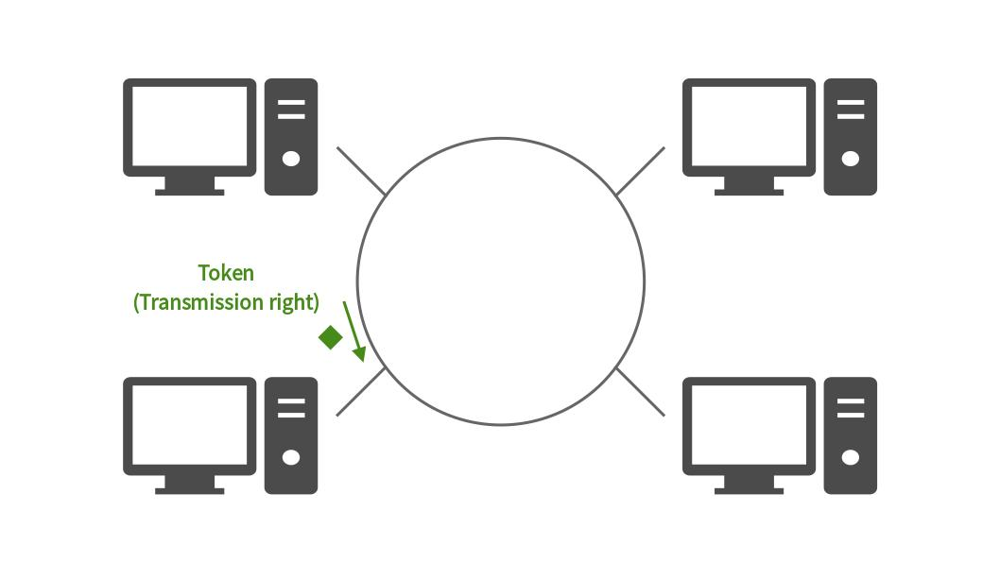

# データリンク層

## 目次

1. [データリンクの役割](#データリンクの役割)
	1. [データリンクの概要](#データリンクの概要)
1. [データリンクの技術](#データリンクの技術)
	1. [MACアドレス](#macアドレス)
	1. [媒体共有型のネットワーク](#媒体共有型のネットワーク)
	1. [媒体非共有型のネットワーク](#媒体非共有型のネットワーク)
1. [イーサネット](#イーサネット)
	1. [イーサネットのフレームフォーマット](#イーサネットのフレームフォーマット)
1. [無線通信](#無線通信)
	1. [無線LAN](#無線LAN)
1. [PPP](#ppp)
1. [その他のデータリンク](#その他のデータリンク)
	1. [ATM](#atm)
	1. [POS](#pos)
1. [公衆アクセス網](#公衆アクセス網)
1. [VPN](#vpn)

## データリンクの役割

### データリンクの概要

**データリンク**では、物理層によって通信媒体の電圧の高低や光の点滅をコンピュータで処理できるように0と1の羅列に変換し、それを**フレーム**（≒パケット）という意味のあるかたまりとして相手に届ける。

データリンクにおけるネットワークの接続形態や構成形態のことを**トポロジー**という。

## データリンクの技術

### MACアドレス

**MACアドレス**はデータリンクに接続しているノードを識別する際に利用される識別子で、48ビットの長さを持つ。[イーサネット](#イーサネット)や[無線LAN](#無線lan)では、**IEEE**（The Institute of Electrical and Electronics Engineers、米国電気電子技術者協会）で規格化されたMACアドレスが用いられている。

一般的な[NIC](./01_basic_knowledge_of_network.md#アドレスとnic)では、MACアドレスはROMに焼きこまれており、同じMACアドレスを持つNICは世界中にひとつしかない。MACアドレスには、NICの製造メーカーを特定する**ベンダ識別子**と、メーカーが決定するビット列が含まれる。ベンダ識別子はIEEEが割り当てる番号で、従来は**OUI**（Organizationally Unique Identifier）と呼ばれていたが、**MA-L**（MAC Address Block Large）に改称された。

### 媒体共有型のネットワーク

**媒体共有型のネットワーク**は通信媒体を複数のノードで共有するネットワークのことで、同じ通信路を使ってデータを送受信する制御を行う。そのため、**半二重通信**（送信している間は受信できず、受信している間は送信できないような通信）となり、通信の優先順位を決める仕組み（コンテンション方式、トークンパッシング方式など）が必要となる。

**コンテンション方式**は、データの送信権を競争で奪い取る方式で、**CSMA方式**（Carrier Sense Multiple Access）とも呼ばれる。複数のステーション（=ノード）から同時にデータが送信された場合には、互いのデータが**衝突**（**コリジョン**）し、壊れてしまうという欠点がある。[イーサネット](#イーサネット)の一部では、CSMA方式を改良した**CSMA/CD方式**（CSMA with Collision Detection）が採用されている。これは、衝突が起こった際にはすぐに送信を停止して通信路を解放し、再度衝突が発生しないように乱数時間待ってから再送する方式である。

**トークンパッシング方式**は、**トークン**と呼ばれるパケットを巡回させて、このトークンで送信権を制御する方式。トークンを持っているステーションだけがデータを送信することができるため、衝突が発生しない。一方で、通信路が混雑していない場合には効率が悪くなってしまうという側面もある。

### 媒体非共有型のネットワーク

**媒体非共有型のネットワーク**は、通信媒体を共有せずに専有する方式で、ステーションは**スイッチ**と呼ばれる装置に接続される。このため、多くの場合が**全二重通信**（送信と受信を同時に行うことができる通信）となる。この方式ではスイッチに高度な機能を持たせることにより、仮想的なネットワークの構築やデータ流量の制御なども可能になる。

スイッチは、フレームの宛先MACアドレスを見て、**転送表**（フォワーディングテーブル）をもとに次にそのフレームを送るルーターやホストを決める。この転送表は、パケットを受け取った際に、そのパケットの送信元MACアドレスと物理的なインタフェースとの対応を**自己学習**することで生成される。スイッチの転送方式としてはストア&フォワード方式やカットスルー方式などがある。

**ストア&フォワード方式**は、フレームの末尾の[FCS](./01_basic_knowledge_of_network.md#ブリッジ)をチェックしてから転送を行うため、壊れたフレームやノイズによるエラーフレームが転送されない。

**カットスルー方式**は、送信先のMACアドレスがわかり次第転送を開始するため、遅延時間が短い半面、エラーフレームを転送してしまう可能性がある。

ブリッジでネットワークを接続する際にループが発生すると、最悪の場合にはフレームがループ内を巡回し続けてネットワークが**メルトダウン**（異常なパケットがネットワークを埋め尽くして通信不能な状態になること）する。**スパニングツリー方式**では、各ブリッジが定期的に**BPDU**（Bridge Protocol Data Unit）と呼ばれるパケットを交換し、使用するポートと使用しないポートを切り替える。これにより、通信路が自動的に切り替わり、ループの発生を防ぐことができる。その他にもスパニングツリーを改良した**RSTP**（Rapid Spanning Tree Protocol）や、**リンクアグリゲーション**、**LLDP**（Link Layer Discovery Protocol）といった方式がある。

ネットワークの仮想化の方法として、**VLAN**（Virtual LAN）技術を利用できるブリッジを用いる方法がある。これを利用することで、ネットワークの配線を変えずにその構成を変えることができる。VLANはスイッチのポートごとにセグメントを分けることで、[ブロードキャスト](./01_basic_knowledge_of_network.md#通信相手の数による通信方式の分類)のトラフィックが流れる範囲を区切ることができる。

## イーサネット

**イーサネット**（Ethernet）はコンピュータなどの機器を優先接続をする際の通信規格のひとつ。他のデータリンクと比べて制御の仕組みが単純なため、NICやデバイスドライバが作りやすく、データリンクの代表的な規格となっている。

イーサネットの普及当初は、複数の端末を1本の同軸ケーブルで繋いだ[媒体共有型](#媒体共有型のネットワーク)の接続が一般的であったが、現在では接続する機器の処理能力向上や転送速度の高速化により、端末とスイッチを占有のツイストペアケーブルなどで繋いだ[媒体非共有型](#媒体非共有型のネットワーク)の接続に置き換わっている。

また、普及当初のイーサネットでは、アクセス制御方式として[CSMA/CD方式](#媒体共有型のネットワーク)が採用されていた。 しかしスイッチの技術が進歩した現在では、媒体共有型のネットワークはほとんど使われていない。

### イーサネットのフレームフォーマット

イーサネットのフレームの先頭には、1と0を交互に並べた**プリアンブル**と呼ばれるフィールドが付けられる。 これは、ここからイーサネットのフレームが始まっている、ということを意味している。プリアンブルの末尾は**SFD**（Start Frame Delimiter）という「11」のフィールドで終わり、それ以降がイーサネットフレームの本体として扱われる。

最後の**FCS**（Frame Check Sequence）は、フレームが壊れていないかを確かめるためのフィールド。

## 無線通信

### 無線LAN

無線通信には電波や赤外線、レーザー光線などを利用する。オフィス内のようなLANの範囲を比較的高速で通信するものを**無線LAN（Wi-Fi）** と呼ぶ。

無線LANが利用する電波は有限で、複数の端末が同じ周波数帯を共有する必要がある媒体共有型である。IEEE802.11では、CSMA/CDによく似た**CSMA/CA**（CSMA Collision Avoidance）というアクセス制御方式を採用している。その他にも利用する帯域が異なる様々な規格があるが、ここでは割愛する（特に[Wi-Fi6](https://www.buffalo.jp/contents/topics/knowledge/wi-fi6/)については新しい技術なので要注目）。

無線LANは非常に便利である一方で、その脆弱性が問題となっている。現在はAESベースの暗号化プロトコルである**WPA2**（Wi-Fi Protected Access 2）が広く普及しているが、今後はさらにセキュリティ機能を拡張した**WPA3**が普及していくと考えられる。

#### その他のチェックポイント

- WiMAX
- Bluetooth
- ZigBee
- LPWA（Low Power, Wide Area）

## PPP

**PPP**（Point-to-Point Protocol）は、1対1でコンピュータを接続するためのプロトコル。従来は電話回線や専用回線などを利用していたが、近年はインターネット接続を利用した**PPPoE**（PPP over Ethernet）としての利用が増えてきた。

#### その他のチェックポイント

- LCP（Link Control Protocol）
- NCP（Network Control Protocol）
- PAP（Password Authentication Protocol）
- CHAP（Challenge Handshake Authentication Protocol）

## その他のデータリンク

### ATM

**ATM**（Asynchronous Transfer Mode）は[コネクション型](./01_basic_knowledge_of_network.md#コネクション型とコネクションレス型)のデータリンクで、「ヘッダ5オクテット + データ48オクテット」の**セル**と呼ばれる単位でデータを処理する。ATMは**AAL**（ATM Adaption Layer）とともに利用される。

ATMはセルが1つでも失われると最大192個のセルを再送しなければいけなくなるという問題がある。

### POS

**POS**（Packet over SDH/SONET）はデジタル信号を光ファイバーでやり取りするための規格。**SDH**（Synchronous Digital Hierarchy）は電話回線や専用線などで信頼性の高い光伝送ネットワークとして広く利用されている。

#### その他のチェックポイント

- ファイバーチャネル
- iSCSI
- InfiniBand
- HDMI
- DOCSIS
- 高速PLC

## 公衆アクセス網

- アナログ電話回線
- モバイル通信サービス
- ADSL
- FTTH
    - ダークファイバー
- ケーブルテレビ
- 専用回線
- 公衆無線LAN
    - ホットスポット

### VPN

**VPN**（Virtual Private Network）は、一般的なインターネット回線上でつくられる、仮想的なプライベートネットワークサービスを指す。

通信事業者が提供するVPNでは、ラベルと呼ばれる情報をIPパケットに付加して通信を制御する[MPLS](./10_routing_protocol.md#mpls)（Multiprotocol Label Switching）技術などが利用されている。

また、企業が独自のVPNを構築する場合には、**IPsec**を用いる方法が一般的である。この場合はVPN上での通信時にIPパケットの認証・暗号化を行い、インターネット上で閉じたネットワークを構築する。

**広域イーサネット**は、通信事業者が提供する離れた地域を結ぶイーサネット接続のサービスで、[VLAN](#媒体非共有型のネットワーク)を利用する。同じVLANを指定すれば、どこからでも同じネットワークに接続できる。
