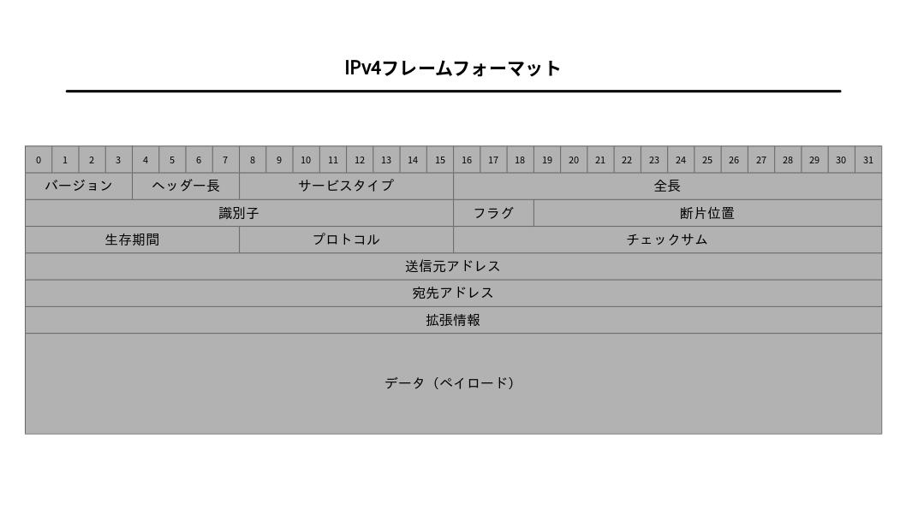

# インターネット層


## 目次

1. [IP](#ip)
	1. [IPとOSI参照モデル](#ipとosi参照モデル)
	1. [ホストとルーターとノード](#ホストとルーターとノード)
1. [IPの基礎知識](#ipの基礎知識)
	1. [IPの役割](#ipの役割)
	1. [経路制御](#経路制御)
	1. [データリンクの抽象化](#データリンクの抽象化)
	1. [IPアドレス](#ipアドレス)
	1. [クラス](#クラス)
	1. [ネットワークアドレスとブロードキャストアドレス](#ネットワークアドレスとブロードキャストアドレス)
	1. [IPマルチキャスト](#ipマルチキャスト)
	1. [サブネットマスク](#サブネットマスク)
	1. [CIDRとVLSM](#cidrとvlsm)
	1. [グローバルアドレスとプライベートアドレス](#グローバルアドレスとプライベートアドレス)
	1. [WHOIS](#whois)
1. [ルーティング](#ルーティング)
	1. [IPアドレスと経路制御](#ipアドレスと経路制御)
1. [IPの分割処理と再構築処理](#ipの分割処理と再構築処理)
	1. [IPデータグラムの分割処理と再構築処理](#ipデータグラムの分割処理と再構築処理)
	1. [経路MTU探索](#経路MTU探索)
1. [IPv6](#ipv6)
	1. [IPv6の特徴](#ipv6の特徴)
1. [IPv4のヘッダフォーマット](#ipv4のヘッダフォーマット)
	1. [DSCPフィールドとECNフィールド](#dscpフィールドとecnフィールド)
1. [IPv6のヘッダフォーマット](#ipv6のヘッダフォーマット)
1. [DNS](#dns)
	1. [DNSの役割](#dnsの役割)
	1. [ネームサーバー](#ネームサーバー)
1. [ARP](#arp)
	1. [RARP](#rarp)
	1. [GARP](#garp)
	1. [代理ARP](#代理arp)
1. [ICMP](#icmp)
	1. [ICMPv6](#icmpv6)
1. [DHCP](#dhcp)
	1. [プラグ&プレイ](#プラグプレイ)
	1. [DHCPの仕組み](#dhcpの仕組み)
1. [NAT](#nat)
	1. [IPv6とIPv4の通信](#ipv6とipv4の通信)
	1. [CGN](#cgn)
	1. [NATの問題点とNAT越え](#natの問題点とnat越え)
1. [IPトンネリング](#ipトンネリング)
1. [その他のIP関連技術](#その他のip関連技術)
	1. [VRRP](#vrrp)
	1. [IPマルチキャスト関連技術](#ipマルチキャスト関連技術)
	1. [IPエニーキャスト](#ipエニーキャスト)
	1. [通信品質の制御](#通信品質の制御)
	1. [Mobile IP](#mobile-ip)


## IP

### IPとOSI参照モデル

**IP**（Internet Protocol）は[OSI参照モデル](./04_osi_reference_model.md)の[ネットワーク層](./04_osi_reference_model.md#ネットワーク層)に相当する。**終点ノード**（**エンドノード**）（通信を行う目的でネットワークの末端に接続される装置）間の通信（**エンドツーエンド（end-to-end）の通信**）を実現する役割を果たす。

[データリンク](./06_datalink_layer.md#データリンクの役割)が1区間のノードを結ぶ[プロトコル](./01_basic_knowledge_of_network.md#プロトコル)をもっているのに対して、IPは最終目的地までの通信を実現するための[プロトコル](./01_basic_knowledge_of_network.md#プロトコル)をもつ。

### ホストとルーターとノード

[インターネット](./01_basic_knowledge_of_network.md#インターネット)の世界において、[IPアドレス](#ipアドレス)が付けられた機器や装置のうち、[経路制御（ルーティング）](#ルーティング)を行わないもののことを**ホスト**と呼ぶ。一方で、[IPアドレス](#ipアドレス)が付けられていて、[経路制御](#ルーティング)を行う機器を**ルーター**と呼ぶ。ホストとルーターを合わせて、**ノード**と呼ぶ。


## IPの基礎知識

### IPの役割

IPの役割は、[IPアドレス](#ipアドレス)、終点[ホスト](#ホストとルーターとノード)までのパケット配送（[ルーティング](#ルーティング)）、IPパケットの分割処理と再構築処理の3つである。

IPは[コネクションレス](./01_basic_knowledge_of_network.md#コネクション型とコネクションレス型)型の通信で、パケットを送信する前にコネクションの確立を行わない。パケットを宛先まで送り届けるために最大限努力を行うことから、**最善努力型（ベストエフォート）のサービス**と呼ばれている。接続の信頼性を高める役目を担うのはIPの上位層である[TCP](./08_routing_protocol.md#tcp)で、これは[コネクション型](./01_basic_knowledge_of_network.md#コネクション型とコネクションレス型)である。

### 経路制御

**経路制御**（**ルーティング**）は、宛先IPアドレスのホストまでパケットを届けるための仕組み。TCP/IPでは、ネットワークの1区間をIPパケットが移動することを**ホップ**といい、この1区間のことを**1ホップ**（**ワンホップ**）という。

IPの経路制御は、**ホップバイホップルーティング**という方式で行われる。この方式ではパケットが行き当たりばったりに（無計画に）移動するため、このことを**アドホック**（ad hoc）という。

宛先の[ホスト](#ホストとルーターとノード)までパケットを届けるために、すべての[ホスト](#ホストとルーターとノード)や[ルーター](#ホストとルーターとノード)は**経路制御表**（ルーティングテーブル）と呼ばれる情報を持っている。

### データリンクの抽象化

データリンクでは、**最大転送単位**（**MTU**： Maximum Transmission Unit）が規格によって異なる。このような特性を吸収するために、[IP](#ipの役割)では**分割処理**（フラグメンテーション）を行う。

### IPアドレス

**IPアドレス**は個々の[ホスト](#ホストとルーターとノード)を特定するための識別子で、32ビットの整数値で表される。これを、人間がわかりやすいように8ビットずつに区切り、境目にドットを入れた表記を**ドット・デシマル・ノーテーション**と呼ぶ。

IPアドレスは**ネットワーク部**と**ホスト部**から構成されている。ネットワーク部は、[データリンク](./06_datalink_layer.md#データリンクの役割)のセグメントごとに異なる値が設定されている（[データリンク](./06_datalink_layer.md#データリンクの役割)の属する地域を特定する部分）。ホスト部は、[データリンク](./06_datalink_layer.md#データリンクの役割)が属するセグメント内で重複しないように値が設定されている（[データリンク](./06_datalink_layer.md#データリンクの役割)のセグメント内の[ホスト](#ホストとルーターとノード)を特定する部分）。

---

WindowsでPCのIPアドレスを調べるには、**コマンドプロンプト**を開いて以下のコマンドを入力する。

```
> ipconfig
```

LinuxでPCのIPアドレスを調べるには、シェルから以下のコマンドを入力する。

```
$ ip a
```

---

### クラス

[IPアドレス](#ipアドレス)の[ネットワーク部](#ipアドレス)と[ホスト部](#ipアドレス)を識別するために以前まで用いられていたのが、**クラス**である。これは、[IPアドレス](#ipアドレス)をクラスA～クラスDの4つのグループに分類したもので、[IPアドレス](#ipアドレス)の始まりからどのクラスであるかを判別していた（先頭2ビットが「10」ならクラスB、など）。

ただし、クラスDは[IPマルチキャスト通信](#ipマルチキャスト)に使われていたため、実際に[ホスト](#ホストとルーターとノード)に割り当てられていたわけではない。

### ネットワークアドレスとブロードキャストアドレス

[IPアドレス](#ipアドレス)には、[ホスト](#ホストとルーターとノード)に割り当てられることがない特別なアドレスが存在する。

**ネットワークアドレス**は[ホスト部](#ipアドレス)がすべて0で、そのネットワーク自体を指すアドレス。

**ブロードキャストアドレス**は[ホスト部](#ipアドレス)がすべて1で、そのネットワークに属しているすべての[ホスト](#ホストとルーターとノード)にパケットを送信するためのアドレス。そのコンピュータ自身が属しているリンク内の[ブロードキャスト](./01_basic_knowledge_of_network.md#通信相手の数による通信方式の分類)を**ローカルブロードキャスト**、異なるIPネットワークへの[ブロードキャスト](./01_basic_knowledge_of_network.md#通信相手の数による通信方式の分類)を**ダイレクトブロードキャスト**という。

### IPマルチキャスト

**IPマルチキャスト**は、特定のグループに所属するすべての[ホスト](#ホストとルーターとノード)にパケットを送信するために利用される。IPマルチキャストには[クラスD](#クラス)の[IPアドレス](#ipアドレス)を使用する。

### サブネットマスク

[IPアドレス](#ipアドレス)の[クラス](#クラス)は無駄が多いため、現在は**サブネットワーク**という仕組みを利用している。

サブネットワークでは、アドレスを2つの識別子によって表現する。1つは[IPアドレス](#ipアドレス)で、もう1つはネットワーク部を表す部分を1、ホスト部を表す部分を0として表した**サブネットマスク**である。

### CIDRとVLSM

1990年代半ばまでは、[IPアドレス](#ipアドレス)の割り当ては[クラス](#クラス)単位で行われていた。しかし[クラス](#クラス)は無駄が多く、すぐにアドレスが不足してしまったため、[サブネットマスク](#サブネットマスク)を用いて任意のビット長で[IPアドレス](#ipアドレス)を配布するようになった。この技術を**CIDR**（Classless InterDomain Routing）と呼ぶ。

また、組織内の部署ごとにネットワークアドレス長を変えられるようにする仕組みを**VLSM**（Variable Length Subnet Mask）という。

CIDRやVLSMの登場により、グローバルIPv4アドレスの不足は一時的に解消されたものの、その絶対数に限りがあることには変わりない。

### グローバルアドレスとプライベートアドレス

本来[IPアドレス](#ipアドレス)は、世界中の[ホスト](#ホストとルーターとノード)の中からひとつのコンピュータを特定できるように一意に定められた識別子であった。しかし、[インターネット](./01_basic_knowledge_of_network.md#インターネット)に接続しない独立したネットワーク上では、[ホスト](#ホストとルーターとノード)は世界で一意のアドレスを持つ必要はなく、そのネットワーク中でユニークなアドレスを持てばよい。

そのため、私的なネットワークで利用できる**プライベートIPアドレス**が誕生した。また、プライベートIPアドレスとグローバルIPアドレスの間でアドレス変換をする**NAT技術**も登場している。

組織内ではプライベートアドレスを設定し、インターネットに接続する[ルーター](#ホストとルーターとノード)（**ブロードバンドルーター**）や、[インターネット](./01_basic_knowledge_of_network.md#インターネット)に公開しているサーバーにだけ[IPアドレス](#ipアドレス)を設定するのが一般的となった。

グローバルIPアドレスは全世界で**ICANN**（Internet Corporation for Assigned Names and Numbers）で一元管理されている。日本国内では**JPNIC**（Japan Network Information Center）がグローバルIPアドレスの割り当てを行っている。

### WHOIS

[インターネット](./01_basic_knowledge_of_network.md#インターネット)において通信経路の途中で問題があった場合、ネットワーク技術者たちは[ICMP](#icmp)パケットを見たり、[traceroute](https://ja.wikipedia.org/wiki/Traceroute)などのツールを活用して、異常が発生している装置を突き止める。この際に、その[IPアドレス](#ipアドレス)を管理している組織や管理者の連絡先を知るために用いられているのが**WHOIS**である。


## ルーティング

### IPアドレスと経路制御

[IPアドレス](#ipアドレス)を見て、どの[ホスト](#ホストとルーターとノード)や[ルーター](#ホストとルーターとノード)にパケットを送信すればよいか、といった情報のことを**経路制御表**（ルーティングテーブル）という。

経路制御表を作成する方法には、管理者が事前に設定する**スタティックルーティング**（静的経路制御）と、他の[ルーター](#ホストとルーターとノード)との情報交換によって自動的に作成される**ダイナミックルーティング**（動的経路制御）がある。

[IP](#ip)自体には経路情報を交換するための機能が備わっていないため、ダイナミックルーティングを行うにはそれ専用の**ルーティングプロトコル**が必要になる。

すべてのネットワークや[サブネット](#サブネットマスク)の情報を経路制御表に持っていると無駄が多くなるため、登録されていないアドレスのための経路である**デフォルトルート**が利用される。

同じコンピュータ内部のプログラム間で通信したい場合に利用されるアドレスを、**ループバックアドレス**という。これにはどのコンピュータにも固定で `127.0.0.1` が割り当てられており、 `localhost` というホスト名がエイリアスとして利用される。

#### その他のチェックポイント

- ホストルート
- リンクローカルアドレス


## IPの分割処理と再構築処理

### IPデータグラムの分割処理と再構築処理

[ホスト](#ホストとルーターとノード)や[ルーター](#ホストとルーターとノード)は、必要に応じてIPデータグラムの**分割処理**（**フラグメンテーション**）を行う。パケットは[ルーター](#ホストとルーターとノード)を経由するたびにこの処理が行われるため、徐々に小さなデータグラムに分割されていく。一方で、データグラムの再構築処理は、終点となる宛先[ホスト](#ホストとルーターとノード)のみで行われる。

### 経路MTU探索

パケットのフラグメンテーションを行うと、分割された小さなデータの一部が失われただけで全体の情報を再送する必要が出てきてしまう。これを避けるために、当初は[TCP](#tcp)においてフラグメンテーションが起こらないくらい小さいパケットを送信し、ネットワークの利用効率を犠牲にしていた。

そこで発展した技術が、[ICMP](#icmp)の到達不能メッセージを利用した**経路MTU探索**である。これは、送信元の[ホスト](#ホストとルーターとノード)で宛先[ホスト](#ホストとルーターとノード)までの経路における[MTU](#データリンクの抽象化)の大きさにデータを分割してから送信する方法で、これによりフラグメンテーションの発生を防ぎながらも最大効率でパケットを送信することができるようになる。


## IPv6

### IPv6の特徴

**IPv6**は、IPv4アドレスの枯渇問題を解決するために標準化された[プロトコル](./01_basic_knowledge_of_network.md#プロトコル)。 IPv4の4倍の16オクテットの長さを持ち、IPv4との互換性を保つ努力が行われている。 IPv6の特徴・目的は以下の通りである。

- [IPアドレス](#ipアドレス)の拡大と[経路制御表](#ルーティング)の集約
- パフォーマンスの向上
- [プラグ&プレイ](#プラグプレイ)機能を必須にする
- 認証機能や暗号化機能の採用
- [マルチキャスト](#ipマルチキャスト)、[Mobile IP](#mobile-ip)の機能を拡張機能として提供


## IPv4のフレームフォーマット



### DSCPフィールドとECNフィールド

**DSCPフィールド**は、初期の頃はサービスタイプ（TOS: Type Of Service）として定義されていた部分で、DiffServと呼ばれる品質制御に利用される。

**ECNフィールド**も同様にサービスタイプに置き換わって利用されているフィールドで、ネットワークがふくそうしていることを通知するために用いられる。


## IPv6のヘッダフォーマット


## DNS

### DNSの役割

インターネットを利用する上で毎回[IPアドレス](#ipアドレス)を覚えるというのは、人間にとっては非常に大変である。そこで、**ホスト名**と呼ばれる識別子を利用して、それと[IPアドレス](#ipアドレス)とを対応付けるということが行われている。

ホスト名と[IPアドレス](#ipアドレス)との対応関係を効率よく管理するためのシステムが**DNS**（Domain Name System）である。また、[IPアドレス](#ipアドレス)が変化しても同じホスト名が利用できる**ダイナミックDNS**という仕組みもある。

**ドメイン名**は、[ホスト](#ホストとルーターとノード)の名前や組織の名前を識別するための階層的な名前のことを指す。

### ネームサーバー

**ネームサーバー**は、[ドメイン名](#dnsの役割)を管理している[ホスト](#ホストとルーターとノード)やソフトウェアのことで、そのネームサーバーが設置された階層（**ゾーン**）の[ドメイン](#dnsの役割)に関する情報を管理している。**ルートネームサーバー**は、ネームサーバーの階層のルート部分に設置されているサーバー。

1つのホスト名（[ドメイン名](#dnsの役割)）に複数の[IPアドレス](#ipアドレス)を割り当てられるDNSを**ラウンドロビンDNS**と呼び、Webサーバーなどの負荷分散に利用される。

DNSに問い合わせを行うソフトウェアを**リゾルバ**という。また、この問い合わせ処理のことを**クエリ**という。

[ホスト名](#dnsの役割)と[IPアドレス](#ipアドレス)の対応を**Aレコード**と呼ぶ。また、上位や下位のネームサーバーの[IPアドレス](#ipアドレス)の対応を**NSレコード**という。メールアドレスとそのメールを受信するメールサーバーの[ホスト名](#dnsの役割)を登録したものを**MXレコード**という。[IPアドレス](#ipアドレス)から、[ホスト名](#dnsの役割)を検索するときの情報は**PTR**という。


## ARP

**ARP**（Address Resolution Protocol）はアドレス解決のための[プロトコル](./01_basic_knowledge_of_network.md#プロトコル)。宛先[IPアドレス](#ipアドレス)を手掛かりにして、次にパケットを受け取るべき機器の[MACアドレス](./06_datalink_layer.md#macアドレス)を知りたいときに利用する。次のホップの[ルーター](#ホストとルーターとノード)の[MACアドレス](./06_datalink_layer.md#macアドレス)を調べるために使用される。

ARPでは、最初にARP要求パケットをネットワークに[ブロードキャスト](./01_basic_knowledge_of_network.md#通信相手の数による通信方式の分類)する。このパケットには知りたい[ホスト](#ホストとルーターとノード)の[IPアドレス](#ipアドレス)が含まれており、該当する[ホスト](#ホストとルーターとノード)はARP応答パケットを返信する。

[IPv6](#ipv6)では、ARPの代わりにICMPv6の**近接探索メッセージ**が利用されている。

### RARP

**RARP**（Reverse ARP）は[ARP](#arp)の逆で、[MACアドレス](./06_datalink_layer.md#macアドレス)から[IPアドレス](#ipアドレス)を知りたい場合に使われる。RARPを使うにはRARPサーバーを用意する必要がある。

### GARP

**GARP**（Gratuitous ARP）は、自分の[IPアドレス](#ipアドレス)に対する[MACアドレス](./06_datalink_layer.md#macアドレス)を知りたい場合に使われる。[IPアドレス](#ipアドレス)の重複を確認したり、スイッチングハブなどのMACアドレス学習テーブルを更新させる働きがある。

### 代理ARP

**代理ARP**（Proxy ARP）は[ルーター](#ホストとルーターとノード)などの機能のひとつで、ネットワーク内の機器からの[ARP](#arp)要求を、本来の機器に代わって返答すること。通常の[ARP](#arp)は、同一セグメント内でIPパケットを配送するときに使われるが、代理ARPは、[ルーティングテーブル](#ルーティング)を使わずにIPパケットを別のセグメントに送りたい場合に使われる。


## ICMP

ネットワークが正常に動作しているかの確認や、異常が発生したときのトラブルシューティング（障害対策）を行うのが**ICMP**（Internet Control Message Protocol）である。ICMPには、IPパケットが目的の[ホスト](#ホストとルーターとノード)まで届いたかどうかを確認する機能や、IPパケットが破棄されたときにその原因を通知する機能がある。

- ICMP 到達不能メッセージ
- ICMP リダイレクトメッセージ
- ICMP 時間経過メッセージ
- ICMP エコーメッセージ
- ICMP ルーター探索メッセージ
- ICMP 拡張エコーメッセージ

### ICMPv6

**ICMPv6**は[IPv6](#ipv6)の通信を行う上でなくてはならない[プロトコル](./01_basic_knowledge_of_network.md#プロトコル)。ICMPはIPv4においては補助的な役割でしかなかったが、ICMPv6はその役割がより重要なものとなっている。

特に**近隣探索**では、近隣探索メッセージを[ブロードキャスト](./01_basic_knowledge_of_network.md#通信相手の数による通信方式の分類)に対して送信し、近隣告知メッセージで[MACアドレス](./06_datalink_layer.md#macアドレス)を通知する。


## DHCP

### プラグ&プレイ

[IPアドレス](#ipアドレス)の管理は非常に面倒で、特にスマートフォンやラップトップPCなど移動を伴う端末では、[IPアドレス](#ipアドレス)の設定を移動のたびに変更する必要がある。[IPアドレス](#ipアドレス)の設定を自動化したり、一括管理を行うために、**DHCP**（Dynamic Host Configuration Protocol）が用いられる。DHCPにより、コンピュータは**プラグ&プレイ**（物理的に機器を接続するだけで、特別な設定をしなくてもその機器が利用可能になること）を実現している。

### DHCPの仕組み

複数のDHCPサーバーを併用した場合に、[IPアドレス](#ipアドレス)のバッティングが起こらないように、次のような工夫がされている。

- DHCPサーバーでは、[IPアドレス](#ipアドレス)を割り当てる前に[ICMPエコー要求パケット](#icmp)を送信し、返事がないことを確認する
- DHCPクライアントでは、割り当てられた[IPアドレス](#ipアドレス)に対して[ARP要求パケット](#arp)を送信し、応答がないことを確認する

また、大規模なネットワークではたくさんのDHCPを管理することになるため、これらを一元管理するために**DHCPリレーエージェント**を用いる。


## NAT

**NAT**（Network Address Translator）は、ローカルなネットワークで[プライベートIPアドレス](#グローバルアドレスとプライベートアドレス)を使用している機器がインターネットへ接続するときに、[プライベートIPアドレス](#グローバルアドレスとプライベートアドレス)を[グローバルIPアドレス](#グローバルアドレスとプライベートアドレス)に変換する技術。

[IPアドレス](#ipアドレス)だけではなく、[TCP](./08_transport_layer.md#tcp)や[UDP](./08_transport_layer.md#udp)で用いる[ポート番号](./08_transport_layer.md#ポート番号)も付け替える**NAPT**（Network Address Ports Translator）もある。 モバイルルーターやスマートフォンのテザリングは、NAPTを利用している。

現在では、NAPTのことを単にNAT、NATのことをベーシックNATと呼ぶことが多い。

### IPv6とIPv4の通信

**NAT64/DNS64**は、[DNS](#dns)と[NAT](#nat)が連携して動作することで、IPv6環境からIPv4環境への通信を実現するための技術。

### CGN

**CGN**（Carrier Grade NAT）は[ISP](./02_history_of_the_internet.md#商用インターネットサービスの開始)レベルで[NAT](#nat)を行う技術。**LSN**（Large Scale NAT）と呼ばれることもある。

### NATの問題点とNAT越え

[NAT](#nat)には、次のような問題点がある。

- [NAT](#nat)の外側から内側のサーバーに接続することはできない
- 変換テーブルの作成や変換処理にオーバヘッドが生じる
- 通信中に[NAT](#nat)が異常動作して再起動した場合、すべての[TCP](./08_transport_layer.md#tcp)コネクションがリセットされる

[IPv6](#ipv6)を使用する、[NAT](#nat)環境を前提としたアプリケーションを利用する、といった方法によって[NAT](#nat)があっても[NAT](#nat)の外側と内側が通信できるようになる。これを**NAT越え**（NAT traversal）という。


## IPトンネリング

IPv4環境同士の通信の間に[IPv6](#ipv6)環境のネットワークが介在する場合、そのままでは通信はできない。**IPトンネリング**では、IPv4パケット全体を1つのデータとして扱い、その前にIPv6ヘッダをつける。

トンネリングを使用すると、追加されるヘッダの分だけ[MTU](#データリンクの抽象化)が小さくなるため、**ジャンボフレーム**（1500バイト以上のペイロードを持つ[Ethernetフレーム](./06_datalink_layer.md#イーサネットのフレームフォーマット)）の利用などの工夫が行われている。


## その他のIP関連技術

### VRRP

スマートフォンやコンピュータは、デフォルトルーター（デフォルトゲートウェイ）を経由して社内[LAN](./01_basic_knowledge_of_network.md#lanとwan)や[インターネット](./01_basic_knowledge_of_network.md#インターネット)を利用する環境が一般的。デフォルトルーターの故障やメンテナンス時にもネットワークが利用できるように、複数の[ルーター](#ホストとルーターとノード)による冗長化を行う仕組みを**VRRP**（Virtual Router Redundancy Protocol）という。

VRRPでは複数の[ルーター](#ホストとルーターとノード)をまとめて運用し、その中の1つをマスタールーター、別の[ルーター](#ホストとルーターとノード)をバックアップルーターとして扱う。マスタールーターは定期的にVRRPパケットを[マルチキャスト](./01_basic_knowledge_of_network.md#通信相手の数による通信方式の分類)を使って送信する。バックアップルーターがこのVRRPパケットを3回連続で受け取れなかったとき、マスタールーターが故障したと判断してマスタールーターを切り替える。

### IPマルチキャスト関連技術

[マルチキャスト](./01_basic_knowledge_of_network.md#通信相手の数による通信方式の分類)の通信は主に[コネクションレス](./01_basic_knowledge_of_network.md#コネクション型とコネクションレス型)の[UDP](./08_transport_layer.md#udp)を使って行われる。通信相手を特定せずにパケットを送信し、受信者がいなくてもそのネットワークを使用し続けるため、ムダが多い。

受信者がいるかどうかの通知には、IPv4では**IGMP**（Internet Group Management Protocol）、[IPv6](#ipv6)では[ICMPv6](#icmpv6)の機能の1つである**MLD**（Multicast Listener Discovery）が用いられる。

**IGMP（MLD）スヌーピング**では、スイッチングハブが通過するパケットを覗き見して、どのポートにどのアドレスのマルチキャストフレームを送ればよいかを知り、無関係なポートにはマルチキャストフレームを流さないようにする。

### IPエニーキャスト

**IPエニーキャスト**は、同じサービスを提供するサーバーに同じ[IPアドレス](#ipアドレス)を付け、クライアントの最寄りのサーバーと通信できるようにする方法。 代表例として、[DNS](#dns)ルートサーバーが挙げられる。

IPエニーキャストでは、1つ目のパケットと2つ目のパケットが同じ[ホスト](#ホストとルーターとノード)に届くという保証がない。そのため、最初の1パケットのみ[エニーキャスト](./01_basic_knowledge_of_network.md#通信相手の数による通信方式の分類)を用いて、それ以降は[ユニキャスト](./01_basic_knowledge_of_network.md#通信相手の数による通信方式の分類)を使うといった処理が行われる。

### 通信品質の制御

[IP](#ip)は[ベストエフォート型](#ipの役割)の通信を提供するが、このような通信には、通信回線が混雑すると性能が極端に低下するという問題がある。このように通信回線が混雑することを、**ふくそう**（輻輳）と呼ぶ。

近年、[IP](#ip)を使った通信サービスの品質（**QoS**: Quality of Service）を保証するための技術が登場している。

**IntServ**は、**RSVP**（Resource Reservation Protocol）エンドツーエンドできめ細かい優先制御を提供するための仕組み。必要な時にだけ**フローのセットアップ**を行って通信品質を制御する。RSVPは、パケットを受信する側から送信する側に向けて制御パケットを流し、その間に存在する[ルーター](#ホストとルーターとノード)に品質制御のための設定を行う。

**DiffServ**は、特定のネットワーク内で大雑把に通信品質を制御することが目的で、DiffServドメインの境界にある[ルーター](#ホストとルーターとノード)によってIPパケットの[DSCPフィールド](#dscpフィールドとencフィールド)を書き換えることによって制御を行う。

ふくそうが起きている場合に、[ホスト](#ホストとルーターとノード)はデータの送信量を減らす必要がある。**ECN**（Explicit Congestion Notification）はふくそう通知機能を実現するための仕組み。

### Mobile IP

スマートフォンやラップトップPCなどの移動を伴うデバイスは、違う[サブネット](#サブネットマスク)に接続するたびに[DHCP](#dhcp)や手作業によって[IPアドレス](#ipアドレス)を割り当て直す必要がある。**Mobile IP**は、[ホスト](#ホストとルーターとノード)が接続している[サブネット](#サブネットマスク)が変わっても、[IPアドレス](ipアドレス)が変らないようにする技術。

- 移動ホスト（MH: Mobile Host）
- ホームネットワーク、ホームアドレス
- 気付けアドレス（CoA: Care-of Address）
- ホームエージェント（HA: Home Agent）
- 外部エージェント（FA: Foreign Agent）
