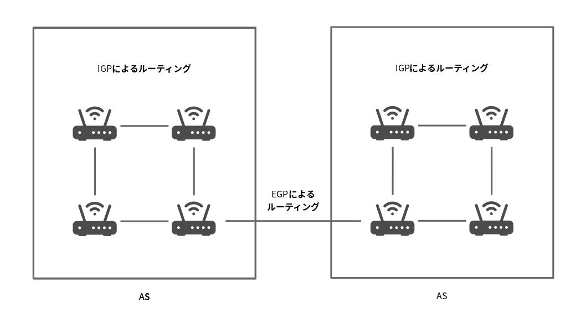

# ルーティングプロトコル

## 目次

1. [経路制御](#経路制御)
1. [経路を制御する範囲](#経路を制御する範囲)
	1. [自律システムとルーティングプロトコル](#自律システムとルーティングプロトコル)
	1. [EGPとIGP](#egpとigp)
1. [経路制御アルゴリズム](#経路制御アルゴリズム)
	1. [メトリック](#メトリック)
	1. [距離ベクトル型](#距離ベクトル型)
	1. [リンク状態型](#リンク状態型)
1. [RIP](#rip)
	1. [RIP2](#rip2)
1. [OSPF](#ospf)
	1. [OSPFの基礎知識](#ospfの基礎知識)
	1. [OSPFの階層化](#ospfの階層化)
1. [BGP](#bgp)
	1. [BGPとAS番号](#bgpとas番号)
	1. [経路ベクトル型](#経路ベクトル型)
1. [MPLS](#mpls)

## 経路制御

[ルーター](./01_basic_knowledge_of_network.dm#ルーター)が正しい方向へパケットを転送するための処理を、**経路制御**や**ルーティング**と呼ぶ。ルーターは**経路制御表**（**ルーティングテーブル**）を参照してパケットを転送する。

経路制御表の作成には、**スタティックルーティング**（静的経路制御）と**ダイナミックルーティング**（動的経路制御）がある。

## 経路を制御する範囲

### 自律システムとルーティングプロトコル

[経路制御](#経路制御)に関するルールを決めて、それをもとに運用する範囲を**自律システム**（**AS**: Autonomous System）や、**経路制御ドメイン**（Routing Domain）という。これは、同一の決まりや考え方（ポリシー）によって[経路制御](#経路制御)を管理する単位のこと。

### EGPとIGP

ルーティングプロトコルは大きく**EGP**（Exterior Gateway Protocol）と**IGP**（Interior Gateway Protocol）に分けられる。EGPは[AS](#自律システムとルーティングプロトコル)間の[経路制御](#経路制御)に利用され、IGPはドメイン内のルーティングプロトコルとして利用される。

この階層関係は、[IPアドレス](./07_internet_layer.md#ipアドレス)の[ネットワーク部](./07_internet_layer.md#ipアドレス)と[ホスト部](./07_internet_layer.md#ipアドレス)の関係に似ている。

## 経路制御アルゴリズム

### メトリック

**メトリック**とは、[経路制御](#経路制御)で使われる距離やコストなどの、転送の判断に使われる指標のこと。

### 距離ベクトル型

**距離ベクトル型**（Distance-Vector）のアルゴリズムでは、物理的な距離と方向によってネットワークや[ホスト](./07_internet_layer.md#ホストとルーターとノード)の位置を決定する。[メトリック](#メトリック)は通過する[ルーター](./01_basic_knowledge_of_network.md#ルーター)の数。

### リンク状態型

**リンク状態型**（Link-State）のアルゴリズムでは、[ルーター](./01_basic_knowledge_of_network.md#ルーター)がネットワーク全体の接続状態を理解して[経路制御表](./07_internet_layer.md#ipアドレスと経路制御)を作成する。すべての[ルーター](./01_basic_knowledge_of_network.md#ルーター)が同じ情報を持ち、安定した[経路制御](#経路制御)を行うことができる。

## RIP

**RIP**は[距離ベクトル型](#距離ベクトル型)のルーティングプロトコルで、経路制御情報を定期的（30秒周期）にネットワーク上に[ブロードキャスト](./01_basic_knowledge_of_network.md#通信相手の数による通信方式の分類)する。メトリックの単位は[ホップ](./07_internet_layer.md#経路制御)数（通過する[ルーター](./01_basic_knowledge_of_network.md#ルーター)の数）で、できるだけ少ない[ホップ](./07_internet_layer.md#経路制御)数で目的の[IPアドレス](./07_internet_layer.md#ipアドレス)に到達できるように制御される。

[ルーター](./01_basic_knowledge_of_network.md#ルーター)が接続切れなどの影響により過去に伝えた情報を逆に教えられ、それをお互いに伝えあってしまう問題を**無限カウント**（Counting to Infinity）という。無限カウントを解決するために、経路情報を教えられたインタフェースには教えられた経路情報を流さない**スプリットホライズン**（Split Horizon）などの対策がある。

しかし、ループのあるネットワークにおいてはこういった方法を用いても無限カウントが発生してしまう。そこで、これを解決するためにポイズンリバースとトリガードアップデートという方法が利用される。

**ポイズンリバース**（Poisoned Reverse）は経路が切れたとき、その情報を流さないのではなく、通信不能であることを表す距離16を流す。

**トリガードアップデート**（Triggered Update）は情報が変化したとき30秒待たずにすぐに伝える方法。

### RIP2

**RIP2**は[RIP](#rip)を改良した[プロトコル](./01_basic_knowledge_of_network.md#プロトコル)で、[マルチキャスト](./07_internet_layer.md#ipマルチキャスト)対応、[サブネットマスク](./07_internet_layer.md#サブネットマスク)対応とかなり実用的になっている。また、1つのネットワーク上で論理的に独立した複数の[RIP](#rip)が使えるようになっており、認証キーにも対応している。

## OSPF

**OSPF**は[リンク状態型](#リンク状態型)のルーティングプロトコル。ループのあるネットワークでも安定した[経路制御](#経路制御)を行うことができる。

[RIP](#rip)では[ホップ](./07_internet_layer.md#経路制御)数が最も少ない方向に経路を設定するが、OSPFでは各リンクに重みをつけることができ、この重みが小さくなるように経路を選択する。この重みのことを**コスト**といい、[メトリック](#メトリクス)としてこのコストが使われる。

### OSPFの基礎知識

[OSPF](#ospf)では、同一リンクに接続されている[ルーター](./01_basic_knowledge_of_network.md#ルーター)を**隣接ルーター**（Neighboring Router）と呼ぶ。すべての隣接ルーター間で経路情報が交換されるわけではなく、**指名ルーター**（Designated Router）を決めることができ、その[ルーター](./01_basic_knowledge_of_network.md#ルーター)を中心に経路制御情報が交換される。

[OSPF](#ospf)では、接続の確認をする[プロトコル](./01_basic_knowledge_of_network.md#プロトコル)を**HELLOプロトコル**という。接続が切れたり回復したりといった接続状態の変化があった場合には、**リンク状態更新パケット**（Link State Update Packet）を送信して、ネットワーク状態の変化を伝える。これにより伝えられる情報は大きく2つあり、**ネットワークLSA**はそのネットワークにはどの[ルーター](./01_basic_knowledge_of_network.md#ルーター)が接続されているかということを表した情報、**ルーターLSA**はその[ルーター](/01_basic_knowledge_of_network.md#ルーター)にはどのネットワークが接続されているかということを表した情報である。この更新情報が送られてきた[ルーター](./01_basic_knowledge_of_network.md#ルーター)は、**リンク状態データベース**（Link State Database）を作成し、それをもとに[経路制御表](./07_internet_layer.md#ipアドレスと経路制御)を作成する。[経路制御表](./07_internet_layer.md#ipアドレスと経路制御)の作成には、**ダイクストラ法**という最短経路を求めるためのアルゴリズムが用いられる。

### OSPFの階層化

[OSPF](#ospf)では計算の負荷軽減のため、**エリア**という概念が取り入れられている。**エリア**は、ネットワーク同士や[ホスト](./07_internet_layer.md#ホストとルーターとノード)同士をまとめてグループ化したもの。

各[AS](#自律システムとルーティングプロトコル)内には複数のエリアが存在できるが、必ず**バックボーンエリア**が必要で、各エリアはこのバックボーンエリアに接続されている必要がある。エリアとバックボーンエリアを結ぶ[ルーター](./01_basic_knowledge_of_network.md#ルーター)を**エリア境界ルーター**、エリア内の[ルーター](./01_basic_knowledge_of_network.md#ルーター)を**内部ルーター**、バックボーンエリアにのみ接続されている[ルーター](./01_basic_knowledge_of_network.md#ルーター)を**バックボーンルーター**、外部と接続している[ルーター](./01_basic_knowledge_of_network.md#ルーター)を**AS境界ルーター**と呼ぶ。

エリア境界ルーターが1つしかない場合には、そのエリアは**スタブエリア**と呼ばれ、経路情報を減らすことができる。

## BGP

### BGPとAS番号

**BGP**は組織間を接続するときに利用される[プロトコル](./01_basic_knowledge_of_network.md#プロトコル)で、[EGP](#egpとigp)に分類される。

[ISP](02_history_of_the_internet.md#商用インターネットサービスの開始)や地域ネットワークなどの組織を束ねるネットワーク集団を1つの[自律システム](#自律システムとルーティングプロトコル)として取り扱い、それぞれの[自律システム](#自律システムとルーティングプロトコル)に16ビットの**AS番号**を割り当てる。

### 経路ベクトル型

[BGP](#bgpとas番号)により経路制御情報を交換する[ルーター](./01_basic_knowledge_of_network.md#ルーター)を**BGPスピーカー**という。

[BGP](#bgpとas番号)では、目的とするネットワークアドレスにパケットを送った場合に、そこに到達するまでの[AS番号](#bgpとas番号)のリストが作られる。これを**AS経路リスト**（AS Path List）と呼ぶ。[BGP](#bgpとas番号)の[メトリック](メトリック)の単位は[AS](#自律システムとルーティングプロトコル)となる。

[BGP](#bgpとas番号)のように、通過する経路のリストで[経路制御](#経路制御)を行う[プロトコル](./01_basic_knowledge_of_network.md#プロトコル)を**経路ベクトル型**（Path Vector）という。

## MPLS

IPパケットの転送には、[ルーティング](./07_internet_layer.md#ルーティング)だけでなく**ラベルスイッチング**という技術も利用されている。これは、それぞれのIPパケットに**ラベル**という別の値を設定し、そのラベルに基づいて転送するというもの。

**MPLS**はラベルスイッチングの代表例で、MPLS機能に対応した[ルーター](./01_basic_knowledge_of_network.md#ルーター)を**LSR**（Label Switching Router）と呼ぶ。特に外部のネットワークとの接続部分にあたるエッジのLSRを**LER**（Label Edge Router）という。

ラベルを付けてフォワーディングする動作を**Push**、ラベルを付け替えてフォワーディングする動作を**Swap**、ラベルを外してフォワーディングする動作を**Pop**という。

MPLSでは宛先が同じであるパケット（**FFC**（Forwarding Equivalence Class））は、どれもラベルによって決まる同一の経路を通る。この経路を**LSP**（Label Switching Path）と呼ぶ。
