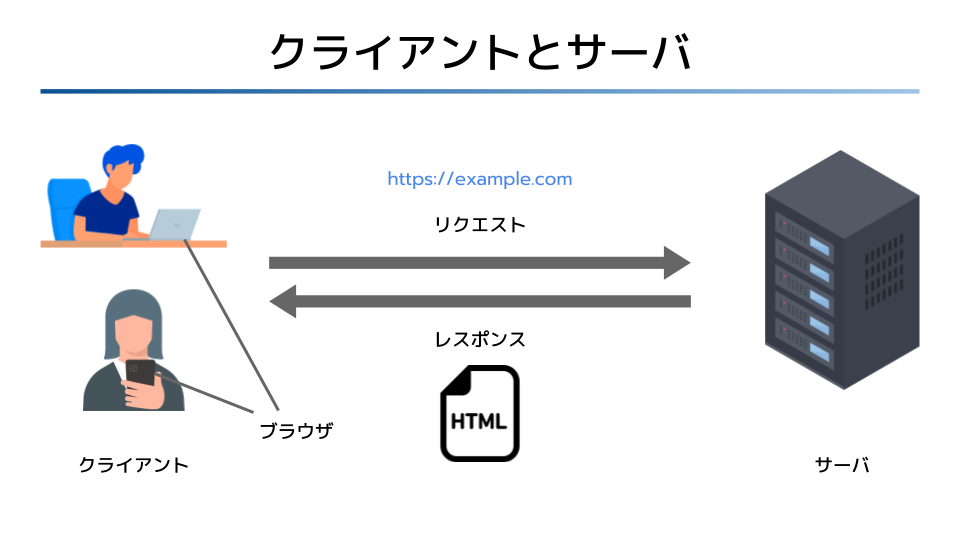

# Webの基礎知識

## 目次

1. [Webの3つの用途](#webの3つの用途)
	1. [Webサイト](#webサイト)
	1. [ユーザインタフェース](#ユーザインタフェース)
	1. [API](#api)
1. [Web3大技術](#web3大技術)
	1. [HTTP](#http)
	1. [URI](#uri)
	1. [HTML](#html)
1. [情報システムとしてのWeb](#情報システムとしてのweb)
	1. [ハイパーメディア](#ハイパーメディア)
	1. [分散システム](#分散システム)
1. [クライアントとサーバ](#クライアントとサーバ)
1. [ブラウザ](#ブラウザ)

## Webの3つの用途

### Webサイト

**Webサイト**はWebが用いられている最も身近な例で、ポータルサイト、ECサイト、コーポレートサイト、SNSなど様々なサービスを提供するものがある。

Webサイトの裏がどのような構成になっているかをクライアントが意識しなくてもよいのは、Webの大きな特徴である。

Webは様々な種類の[ブラウザ](#ブラウザ)に加え、スマートフォンや携帯ゲーム機、テレビなどの多様な**ハードウェアデバイス**から利用されている。

### ユーザインタフェース

Web技術は、**ユーザインタフェース**（**UI**、User Interface）の分野でも活躍している。

ルータやプリンタなどの各種デバイスの設定をブラウザで行う例も少なくない。これは、デバイスにいくつもの操作ボタンやパネル、リモコンを付属させるよりも、PCのキーボードで操作させた方が効率的だからである。

また、Windowsには**HTMLヘルプ**と呼ばれる機構があり、HTMLをベースにしてソフトウェアのヘルプなどを作成できる。

### API

**API**（Application Programming Interface）としてもWebは活用されている。

APIとはプログラム用のインタフェースであり、データフォーマットとしては**XML**（Extensible Markup Language）や**JSON**（JavaScript Object Notation）が使われることが多い。

## Web3大技術

### HTTP

**HTTP**（HyperText Transfer Protocol）は、インターネット上でWeb通信を行うための[アプリケーションプロトコル](../internet/01_basic_knowledge_of_network.md#プロトコル)。

### URI

**URI**（Uniform Resource Identifier）は、インターネット上の[リソース](./03_rest.md#リソース)を特定するための識別子。

### HTML

**HTML**（HyperText Markup language）は、Web上で情報を表現するためのフォーマット。

## 情報システムとしてのWeb

### ハイパーメディア

**ハイパーメディア**とは、テキストや音声、映像などの様々なメディアを**ハイパーリンク**（Hyper Link）で結び付けて構成したシステムのことである。

ハイパーリンクあるいは単に**リンク**とは、ハイパーメディアにおいて情報同士を結び付ける機構のことを指す。リンクはWebに欠かせない基本技術であり、Googleの**ページランク**（Page Rank、Googleの検索エンジンにおける指標のひとつ）や**トラックバック**（Trackback、他サイトに自身の記事のリンクが作られたときにそれを通知する機能）といった技術はリンクを前提に設計されている。

### 分散システム

1つの中央コンピュータがすべてを処理する形式を、**集中システム**（Centralized System）と呼ぶ。これに対して複数のコンピュータを組み合わせて処理を分散させる形式を**分散システム**（Destributed System）という。

分散システムでは、複数のコンピュータ上に存在するデータを一元的に扱うなどして、1つのコンピュータでは扱いきれない膨大な情報を処理することができる。また、1台のコンピュータよりも効率的に処理を行うことができ、集中システムでは難しい機能や性能を実現できる。

Webは世界中に設置された[サーバ](#クライアントとサーバ)に世界中のブラウザがアクセスする巨大な分散システムである。

## クライアントとサーバ

**クライアント**は、サーバが提供する機能や情報を受け取るソフトウェア。Webにおけるクライアントソフトウェアは[ブラウザ](#ブラウザ)である。

**サーバ**は、システムで利用されるデータを保存・管理し、クライアントにサービスを提供するソフトウェア。

サーバに設置されたWebサイトを利用する場合、クライアントはサーバにアクセスしてHTMLをダウンロードし、ブラウザに表示する。サーバには、自分で用意したコンピュータを使うこともできるが、[AWS](../aws/01_basic_knowledge_of_aws.md#aws)などの**クラウドコンピューティングサービス**で提供されたコンピュータを利用することもできる。

## ブラウザ

**ブラウザ**は、Web上のコンテンツを閲覧（ブラウジング）するためのソフトウェア。Google ChromeやMicrosoft Edge、Mozilla Firefox、Apple Safariなど、様々な種類がある。

HTMLやCSS、JavaScriptなどをどのように解釈するかはブラウザ次第であるため、それぞれのブラウザでWebコンテンツの表示や挙動は微妙に異なる。

--

- [チェックシート](./00_check.md)
- Webの基礎知識
- [Webの歴史](./02_history_of_web.md)
- [REST](./03_rest.md)
- [URI](./04_uri.md)
- [HTTP](./05_http.md)
- [ハイパーメディアフォーマット](./06_hypermedia_format.md)
